

  

    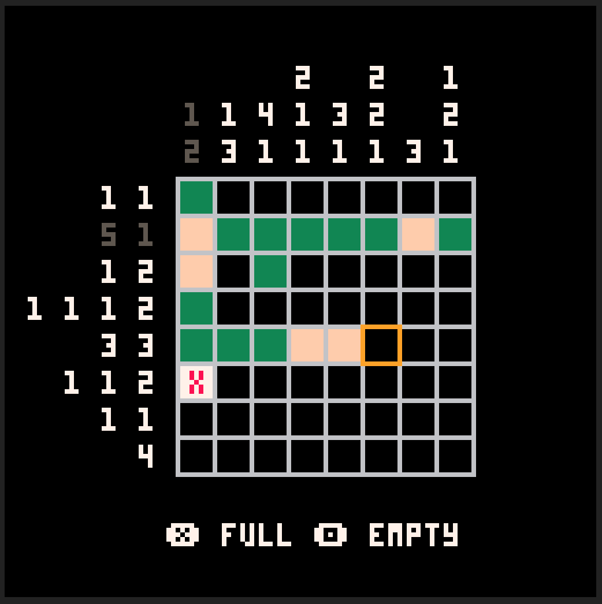
    

      <a href="/projects/picross8">Picross8</a>
    

    

      
Puzzle game

      
Pico-8

    

  

  

    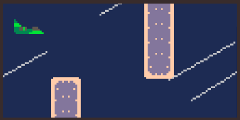
    

      <a href="/projects/bouncing-plane">Bouncing Plane</a>
    

    

      
Flappy Bird like

      
Pico-8

    

  

  
  

    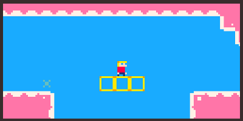
    

      <a href="/projects/boby"><strong>[LOWREZJAM]</strong> Bobby's land</a>
    

    

      
Platform game

      
Flash (heaps)

    

  

  

    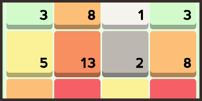
    

      <a href="/projects/coloring">Coloring</a>
    

    

      
Puzzle game

      
Flash, Android

    

  

  

    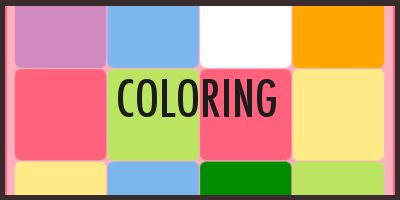
    

      <a href="/projects/ld31"><strong>[LD31]</strong> Coloring</a>
    

    

      
Puzzle game

      
Html5

    

  

  

    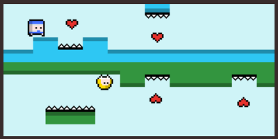
    

      <a href="/projects/2lovers"><strong>[LD30]</strong> 2LOVERS</a>
    

    

      
Platformer

      
Html5

    

  

  

    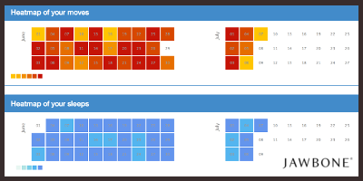
    
<strong>[RIP]</strong> Jawbone UP analyser

    

      
Web application

      
Javascript, PHP

    

  

  

    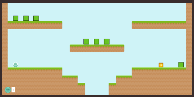
    

      <a href="/projects/arena-invasion"><strong>[WIP]</strong> Arena Invasion</a>
    

    

      
Shoot them up

      
Html5

    

  

  

    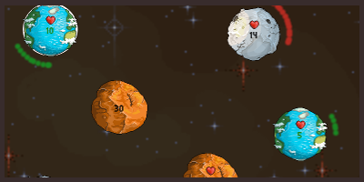
    

      <a href="/projects/planets-experiment">Planets Experiment</a>
    

    

      
Prototype

      
Html5

    

  

  

    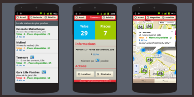
    

      <a href="/projects/lille-aux-velos"><strong>[RIP]</strong> Lille Aux Vélos</a>
    

    

      
Web application

      
Android

    

  

  

    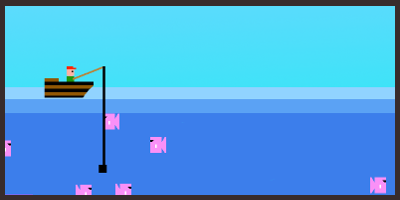
    

      <a href="/projects/what-the-fish"><strong>[LD26]</strong> What The Fish !</a>
    

    

      
Shoot them up

      
Flash

    

  

  

    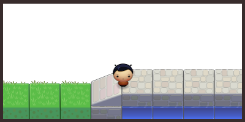
    

      <a href="/projects/1gam-january-2013"><strong>[1GAM]</strong> January 2013</a>
    

    

      
Prototype

      
Flash, Nape physics engine

    

  

  

    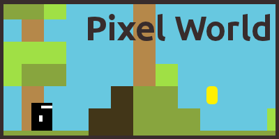
    

      <a href="/projects/pixel-world"><strong>[LD23]</strong> Pixel World</a>
    

    

      
Platformer

      
Flash

    

  

  

    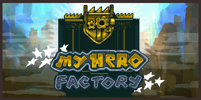
    

      <a href="/projects/my-hero-factory"><strong>[LD20]</strong> My Hero Factory</a>
    

    

      
Puzzle game

      
Flash

    

  

  

    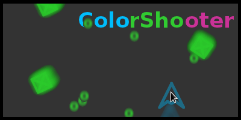
    

      <a href="/projects/color-shooter">Color Shooter</a>
    

    

      
Shoot them up

      
Flash

    

  

  

    
    

      <a href="/projects/match-fruits">Match Fruits</a>
    

    

      
Puzzle game

      
Flash

    

  

