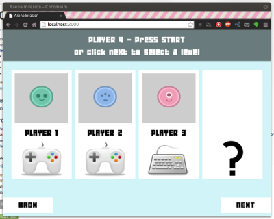
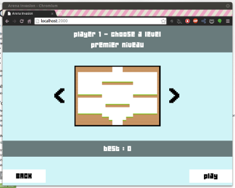

After some hours of work, here is the new features for this <strong>second beta</strong> :

* Up to 4 players (1 keyboard and 3 game pads, or 4 game pads)
* Desktop app with <strong>full screen</strong> support (thanks to <a href="https://github.com/rogerwang/node-webkit">node-webkit</a>)
* <strong>New weapons</strong>

* Shotgun
* Magnum
* Machine gun
* Double gun

* Each weapon has limited ammunition
* New user interface
* Monsters has now lives

## What's next

* More game design

## Before playing, here are some instructions

* Use the mouse to navigate in the menu
* Each player needs to press start (or enter) for his controller, if the same player re press the same pad's button, then it will go back to the previous player's controller selection
* Use the keyboard to select a level
* Keyboard : arrow keys to move, SPACE to shoot
* Game pad : left joystick to move, A - cross to jump, X - square to shoot

## Download

Download the game to test it, and let me know what you think about it. Keep in mind that it's a beta version ;)

* <a href="http://bit.ly/1g9XwXI">Linux 32bit</a>
* <a href="http://bit.ly/1lhOpWL">Linux 64bit</a>
* <a href="http://bit.ly/1lP7FhZ">Windows</a>
* <a href="http://bit.ly/1bIXyVu">Mac</a>
* <a href="http://bit.ly/1bfvMCj">Node-webkit package</a>

  
  

> You can play it [here](/projects/arena-invasion/).