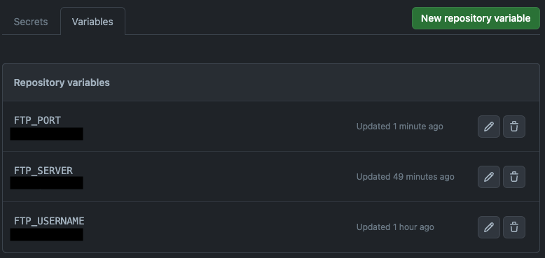
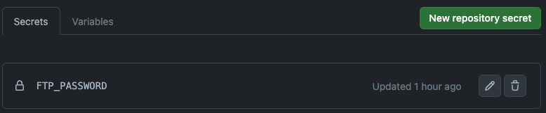
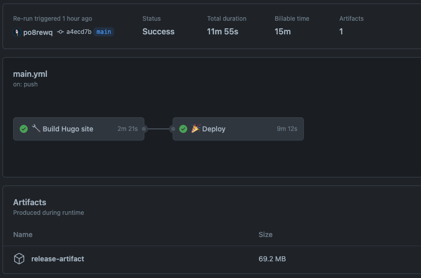

## Introduction

Nowadays, it never has been easier to build and host a website for having any form of online presence. You don't even need a lot of web development knowledge. There are many tools and resources available that make the process easier than ever. One such tool is [Hugo](https://gohugo.io/), a fast and flexible static site generator that allows users to create websites quickly and easily. In addition, deploying a Hugo site to a web server can be made even simpler through the use of [Github Actions](https://github.com/features/actions) (assuming your code is hosted on github), a powerful automation tool that can be used to automatically deploy a website to a FTP server. In this article, we'll explore how to use Hugo to build a website and then deploy it to a FTP server using Github Actions, providing a step-by-step guide for those looking to get their website up and running quickly and efficiently.

## Github actions

Github actions is a great tool to automate your workflow. It is free for repositories (with some limitations on private repositories) and you can use it to build, test and deploy your code.

### Setting up the environment variables

You need to set up some environment variables in your repository. You can do this by going to `Settings > Secrets & Variables > Actions` in your Github repository (under `Security`).

You need to set up the following variables:





### Creating the workflow

Now that we have the environment variables set up, we can create the workflow. You can create a file called `main.yml` in the `.github/workflows` folder in your repository.

The workflow consists of two jobs: "build" and "deploy". The "build" job builds the hugo site and the "deploy" job deploys the site to the FTP server.

```yaml
name: 🚀 Deploy to prod

# Will trigger the workflow on each push to the main branch
on:
  push:
    branches:
      - main

  # Allows you to run this workflow manually from the Actions tab
  workflow_dispatch:

jobs:
  # The first job will build the hugo site and upload the artifact
  build:
    name: 🔧 Build Hugo site
    runs-on: ubuntu-latest
    env:
      HUGO_VERSION: 0.111.2
    steps:
      - name: Install Hugo CLI
        run: |
          wget -O ${{ runner.temp }}/hugo.deb https://github.com/gohugoio/hugo/releases/download/v${HUGO_VERSION}/hugo_extended_${HUGO_VERSION}_linux-amd64.deb \
          && sudo dpkg -i ${{ runner.temp }}/hugo.deb

      - name: Install Dart Sass Embedded
        run: sudo snap install dart-sass-embedded

      - name: Checkout
        uses: actions/checkout@v3
        with:
          submodules: recursive
          fetch-depth: 0

      - name: Install Node.js dependencies
        run: '[[ -f package-lock.json || -f npm-shrinkwrap.json ]] && npm ci || true'

      - name: Build with Hugo
        env:
          # For maximum backward compatibility with Hugo modules
          HUGO_ENVIRONMENT: production
          HUGO_ENV: production
        run: |
          hugo \
            --gc \
            --minify

      # We save the result as an artificat so we can use it in the next job
      - name: Upload artifact
        uses: actions/upload-artifact@v3
        with:
          name: release-artifact
          path: './public'

  # The second job will deploy the site to the FTP server using the artifact from the first job
  deploy:
    name: 🎉 Deploy
    runs-on: ubuntu-latest
    needs: build
    steps:
      - name: Checkout
        uses: actions/checkout@v3

      # Download the artifact we just created
      - name: Download artifact
        uses: actions/download-artifact@v3
        with:
          name: release-artifact
          path: './public' # This is the path where the artifact will be downloaded to

      - name: Deploy file
        uses: wlixcc/SFTP-Deploy-Action@v1.2.4
        with:
          server: ${{ vars.ftp_server }}
          username: ${{ vars.ftp_username }}
          ssh_private_key: ${{ secrets.ftp_password }}
          # or if you only use a password
          # sftp_only: true
          # password: ${{ secrets.ftp_password }}
          port: ${{ vars.ftp_port }}
          remote_path: '/var/www/app' # This will depend on your server
          local_path: './public/*' # This is the path where the artifact is located
```

Now you only need to commit and push your changes to the main branch and the workflow will be triggered.



Sources:

- [Hugo: Host on GitHub](https://gohugo.io/hosting-and-deployment/hosting-on-github/)
- [SFTP Deploy](https://github.com/marketplace/actions/sftp-deploy)

## Other alternatives

You can deploy your hugo site to a lot of other services like Netlify, Vercel, Render, etc. You can find a list of all the services [here](https://gohugo.io/hosting-and-deployment/).
