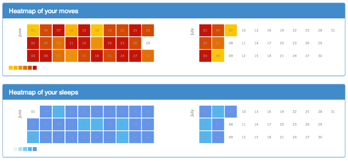
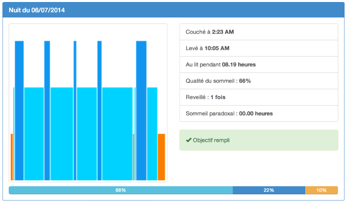

I've worked all week end on a personal project based on the <a href="https://jawbone.com/up/developer">Jawbone UP API</a>.

## What's the objective ?

<a href="https://jawbone.com/up/">Jawbone</a> created a great phone app, <strong>easy to use</strong> and <strong>quite beautiful</strong>. But I want to let the user <strong>analyze data</strong> with <strong>another experience</strong>. Not only check data per day, but to be able to find patterns for bad/good habits.

Here is the first feature, that analyzes moves and sleeps through a <strong>heat map</strong> (using <a href="http://kamisama.github.io/cal-heatmap/">cal-heatmap</a>) :

Of course, all classical vizualiser are implemented too :

With a simple look, you can see if your objective is filled, and how was your night through a progress bar (light sleep, sound sleep, awake time), or through the Jawbone graph.

I've already implemented the same thing for sleeps and workouts.

## What's next ?

I need to implement research for a specific date (if you need to check for specific data) and <strong>some extra cool features</strong>... Stay tuned for that :)

No availability date for now.