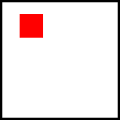
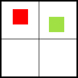
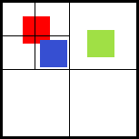

## What is the QuadTree ? ##

If we look at the <a href="http://en.wikipedia.org/wiki/Quadtree">wikipedia</a> page, we can find a small explanation (it's the best one I have found so far) :

> A quadtree is a tree data structure in which each internal node has exactly four children. Quadtrees are most often used to partition a two dimensional space by recursively subdividing it into four quadrants or regions.

## Why would I add it ? ##

The first approach to **detect collisions** between entities was to check **for each entity** if it collided with one of the others entities in the world. So you can use this method for a really small game, because the number of tests is not that big. But if you have, for example, a game with 100 entities moving around the screen, which can collide with each other, the number of tests between entities will be 100x100 !! And at least half (probably more) of them are **not necessary**.
The Quadtree allows you to eliminate those unnecessary checks.

## How does it work ? ##

Each time an entity is added to the stage, we just have to look into the tree and find where to put it. A node is simply a rectangular zone with entities and other nodes in it.

So basically, any node will be **divided in 4 nodes** if **more than n entities** are **completely contained** within the node. For AGE, I have decided to use n = 2.

Here is a more concrete example :

The world has 1 entity, the entity is added to the root node (depth = 0).

A second entity is added, so the world has been divided. The first entity (the red one) is pushed down to the top left node, and the second one is pushed down to the top right node (depth = 1).

A third entity is added to the stage. This one is contained in the top left node. This node **has already another entity**, so we just divide this node in 4. Now the first entity (the red one) does not fit entirely in a sub node, so this entity is going to stay on the same node (**top left at depth 1**). But the other entity (the blue one) is pushed down to the **bottom right node at depth 2**. For the last entity, nothing has to change for now.

Now, our tree **has been set**. Before checking for collisions, we have **to query the tree** to determine which entities are **worth testing for a rectangular zone** (the rectangular zone can correspond to the theoretical position of an entity, to know if we can move it or not). So, the quadtree is going to **return each entity contained in a node that have an intersection with our request zone** (we have to return entities that are not entirely in a sub node too).

Here is a simple example: use the arrow keys to move the black entity, and look at the nodes (especially when near the entity at the right of the world) : 

<object width="650" height="650" background-color="#CECECE" data="quadtreedemo.swf"></object>