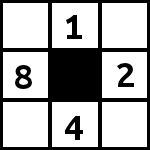
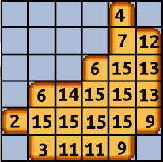
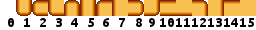
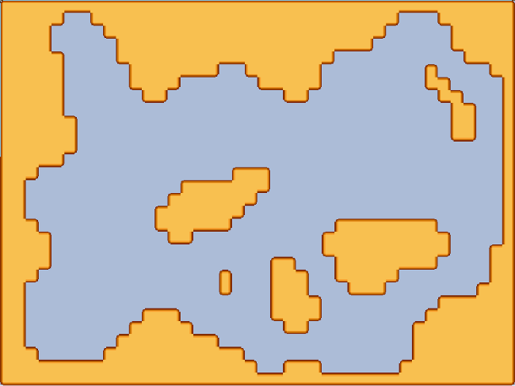

Maintenant que nous avons vu comment avoir un <a href="/generation-aleatoire-dun-donjon/">monde généré aléatoirement</a>, et pouvant servir de donjon, voyons maintenant comment **appliquer un tileset** sur cette même map.

Nous avons besoin de **déterminer l’état de chaque cellule** en fonction de **l’état des quatre cellules avoisinantes** (on ne prendra pas compte des diagonales).

Plutôt que partir sur des conditions relativement énorme vu le nombre de cas à traiter, nous allons nous baser sur le même principe que pour les **nombres binaires**, car de la même manière nous devons représenter une combinaison de 4 valeurs dans un état 1 ou 0.

## Un peu de théorie ##

Pour essayer de mieux comprendre, voici l'énumération des premiers nombres, et ce que ça veut dire pour nous.

* **Décimal** - **Binaire** (**Explication**)
* 0 - 0
* 1 - 1 (2⁰)
* 2 - 10 (2¹)
* 3 - 11 (2¹ + 2⁰)
* 4 - 100 (2²)
* 5 - 101 (2² + 2⁰)
* 6 - 110 (2² + 2¹)
* 7 - 111 (2² + 2¹ + 2⁰)
* 8 - 1000 (2³)
* ...

## Ok... mais comment je détermine la valeur de mes cellules ? ##

En pratique nous devons donc **regarder les cellules environnantes** et **déterminer la valeur de chaque cellule** en fonction des autres.

Tout d'abord le schéma correspondant aux valeurs de chaque cellule voisine :

Une case pleine sur la **gauche** vaut **8**, une case pleine en **dessous** **4**, un case pleine au **dessus** **1**, et une case à **droite** **2**.

Et voici un exemple avec les valeurs pour chaque cellule pleine :

Chaque valeur ainsi obtenue permet d'avoir **la position** de la tile dans la **tileset** :

Et voici un rendu final :

