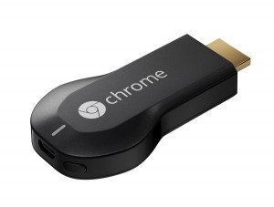
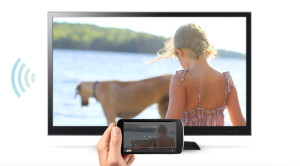

At last, the <strong>Chromecast is available in Europe</strong>. You can find it on the <a href="https://play.google.com/store/devices/details/Chromecast?id=chromecast">play store</a> or in physical stores for <strong>35€</strong> (cheap, right?).

## What is Chromecast ?

> Chromecast is a thumb-sized media streaming device that plugs into the HDMI port on your TV. Set it up with a simple mobile app, then send your favorite online shows, movies, music and more to your TV using your smartphone, tablet or laptop.
> <strong><a href="http://www.google.com/intl/en/chrome/devices/chromecast/index.html">From the chromecast website</a></strong>

## How does it work ?

It's really simple, you just have to plug the hdmi key into your tv, and go to <a href="http://chromecast.com/setup">chromecast.com/setup</a> to setup the key (you can use a mobile or your desktop to do that). And that's it.

Now go to a compatible application, click on the icon and enjoy.

The only problem is that you have to be connected on the same network, you can't just broadcast a content to the key (I was thinking about displaying a presentation from my tablet to a TV, but it's impossible to do so without any network...).

## The existing apps

So... In France, there are not much apps for now (the chromecast has only been available for a few days). But you can use all of google's app (music - movies), France Television's catch up app, SFR, and that's pretty much it (for the officials apps). CanalPlay and probably Netflix will come soon.

You can find others by searching "chromecast" in the play store.

## Let's code

A few days ago, Google released another update for the Chromecast SDK (check out the <a href="https://developers.google.com/cast/docs/release-notes">release note</a>).

I've tested the Chrome Sender API, and it's pretty cool. You just have to install the google cast plugin into Chrome, and start a new app.

As usual, I'm coding with Haxe ;)

I've started to create all external classes, it's available on <a href="https://github.com/po8rewq/js-chromecastSenderApi-hx-externs">Github</a>.

Here is a basic initialization (don't forget to activate the Google Cast plugin) :


var sessionRequest = new SessionRequest(Media.DEFAULT_MEDIA_RECEIVER_APP_ID);
var apiConfig = new ApiConfig(sessionRequest, sessionListener, receiverListener);

Chromecast.initialize(apiConfig, onInitSuccess, onError);



function onInitSuccess(){
  trace('init success');
}

function onError(){
  trace('init error');
}

function sessionListener(s: Session) {
  session = s;
  trace('New session ID: ' + session.sessionId);
}

function receiverListener(pStatus: String) {
  if(pStatus == ReceiverAvailability.AVAILABLE)
    trace('receiver available');
}


Now, if you want to broadcast something :


var mediaInfo = new MediaInfo("http://commondatastorage.googleapis.com/gtv-videos-bucket/big_buck_bunny_1080p.mp4", "video/mpeg");
var request = new LoadRequest(mediaInfo);
session.loadMedia(request, onMediaDiscovered, onMediaError);



function onMediaDiscovered(media: Media){
  trace("new media session ID:" + media.mediaSessionId );
}

function onMediaError(e:Dynamic){
  trace(e);
}


With these few lines, you can create a video player from Chrome, and displaying the content to your TV.

Check out the <a href="https://developers.google.com/cast/docs/chrome_sender">documentation</a> and have fun!
