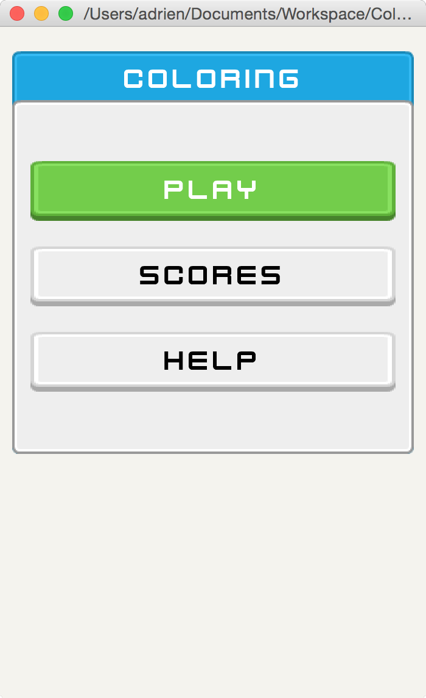
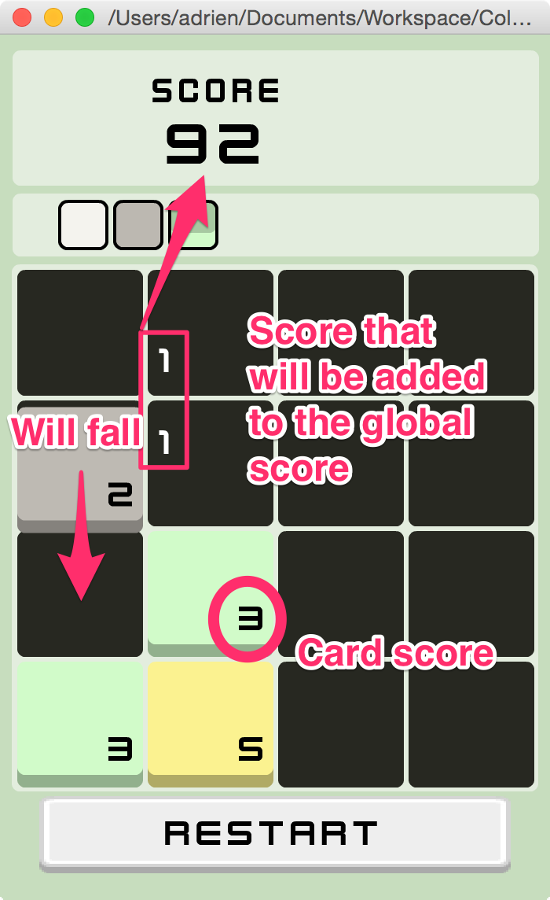
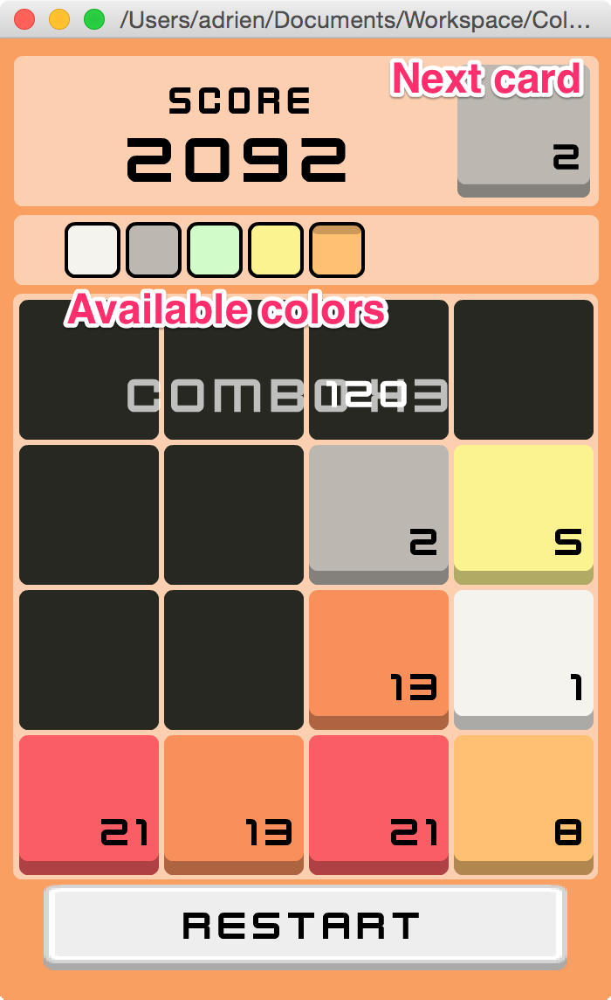

It took me a while, but here is the new version of my [last LD entry](/work/ld31.html). 

So what's new so far: 

 * Complete rewrite: I use openfl to be able to deploy it to mobile (only tested on Android so far)
 * Animations
 * New score system with combos (based on the Fibonacci sequence)
 * Better merge system
 * User Interface (based on [Kenney's assets](http://kenney.nl/assets))

For a better understanding, here are some screenshots :

	
  
	

Stay tuned for the more information :)