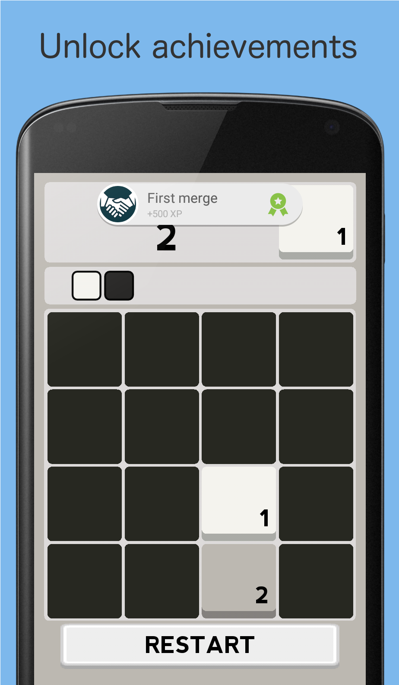
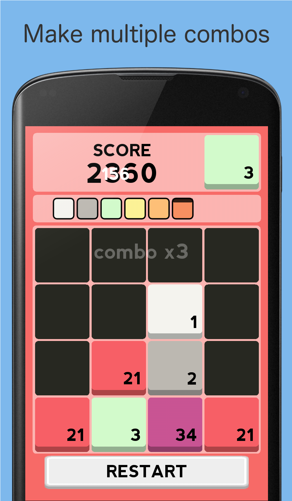
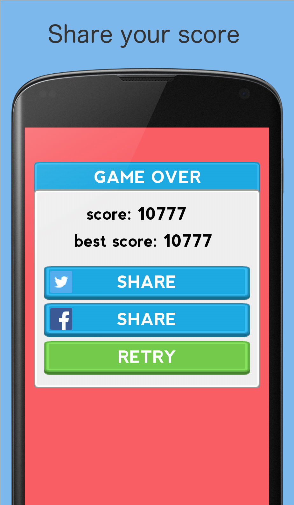
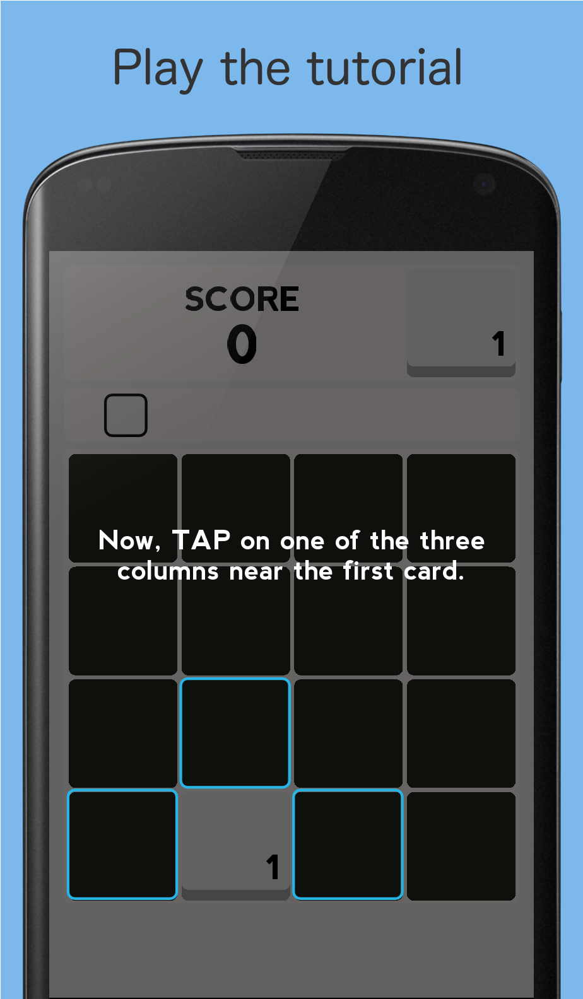

It took me a while but I finally did it.

I released a new version of my LD31 entry, [coloring](/work/ld31.html).

I had to rewrite it completely, because I used my **HTML5 framework** ([AGE](https://github.com/po8rewq/AGE)) and I wanted to deploy it on **mobile**. So thanks to **haxe and OpenFl** I did it without trashing all my old code.

So what's new ?

 * Animations
 * Better score handling with combos
 * A preview of the colors order and which one can pop
 * A tutorial, to help the beginners understand the game mechanism
 * Google play integration for the Android version (leaderboard and trophies)
 * Lots of bug fixes :)

  
  
  
  

For the first time, I did integrate **unit tests** in order to test all (or at least the most) game possibilities. For that I used [munit](https://github.com/massiveinteractive/MassiveUnit) which is really great.

For the leaderboard integration, I've used [linden-google-play library](https://github.com/sergey-miryanov/linden-google-play) which is a native extension for OpenFl.

So here you can play the [old version](/work/ld31.html), and the new one on [itch.io](http://revolugame.itch.io/coloring) or directly on Google Play:

Enjoy, and let me know what you think.
