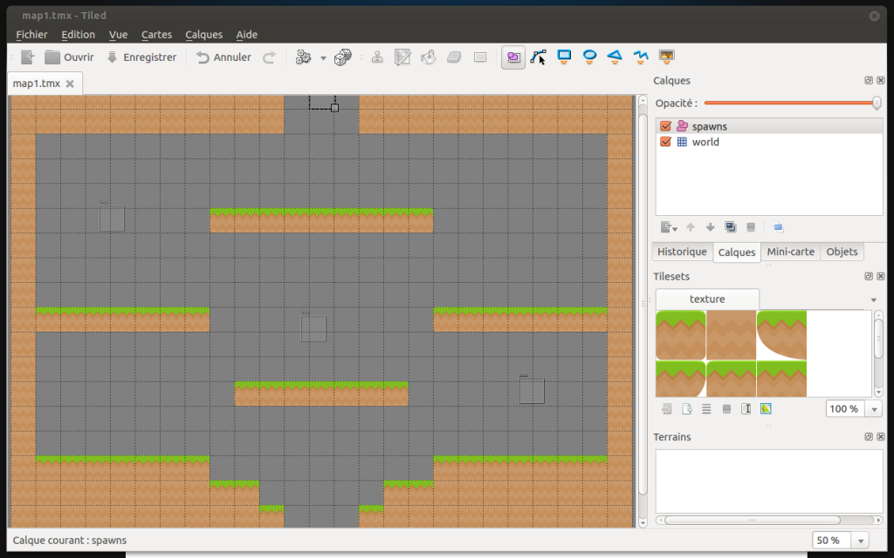
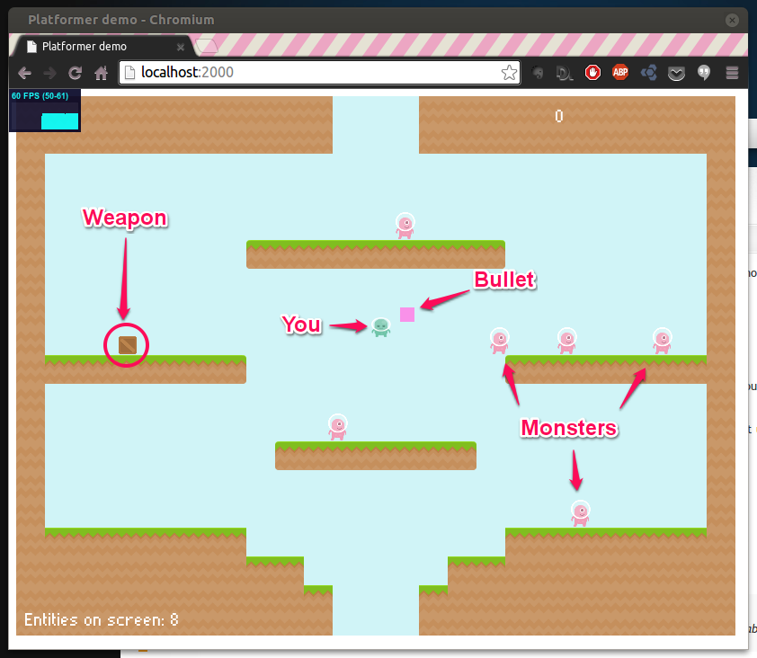

My new job has made me realize how much <strong>I miss coding games</strong>.
So this weekend, I've decided to start on an old idea of mine for the February's <a href="http://www.onegameamonth.com/">OneGameAMonth</a>.
Nothing really new actually, but I need to (re)start from somewhere.

## The concept

It's mostly a <a href="http://www.supercratebox.com">super crate box</a> like game. You are alone in an arena, and you have to fight until you die.

<strong>Power ups</strong> and <strong>weapons</strong> are spawning <strong>randomly</strong> in the level. The player will be able to carry only one weapon, so if you take a weapon, you'll loose the previous one. But you can't use a weapon indefinitely, each weapon has a number of shots (except for the default gun). So be careful with your choices.

The goal is to obtain the <strong>better score you can</strong>. You need to beat a score to unlock the next level.

I would like to have a <strong>multi-player local mode</strong>, where you are both (or maybe 1 to 4 players?) in the <strong>same arena</strong>, and you have to get the better score. You can't directly kill the other players, but you can help them die.
## The tools

As always, I've been using :

* <a href="http://haxe.org">Haxe</a> with my personal html5 engine <a href="https://github.com/po8rewq/AGE">AGE</a>
* <a href="http://www.mapeditor.org/">Tiled</a>
* Kenney's <a href="http://kenney.nl/post/platformer-art-assets-deluxe">Platformer art assets DELUXE</a>

## The prototype

Right now, what's working?

* Movements - Gravity - Collisions detection
* You can use the <strong>XBOX 360</strong> and <strong>PS3</strong> controllers (and probably others) and the keyboard
* Monsters spawns
* Power ups' boxes spawns (but power ups are not implemented yet)
* Scores (Right now, you can't really die, and since monsters are indefinitely spawning from the top of the level, you could have a huge score :D)

So, what's next?

* More monsters
* More weapons
* More levels
* Multi-players mode

Here is a screenshot:

> You can play it [here](/projects/arena-invasion/).

Stay tuned...