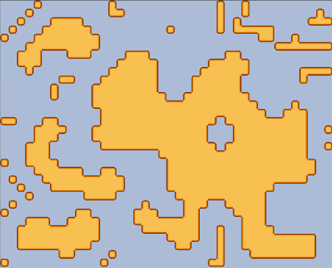
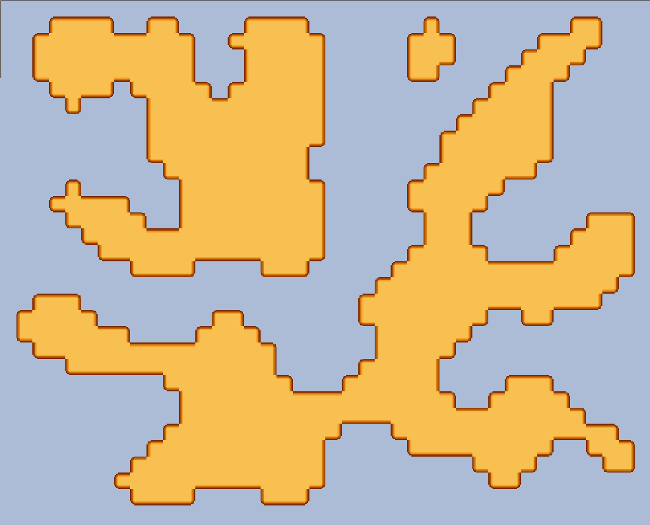
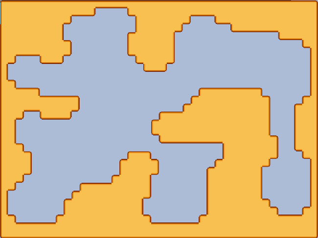

Dans le post <a href="/generation-aleatoire-dun-terrain-cellular-automaton/">Génération aléatoire d’un terrain</a>, nous avons vu comment générer un terrain grâce à la méthode des **Automates Cellulaires**.

Dans ce post-ci, nous allons maintenant voir comment générer **des donjons**, c'est-à-dire avoir la possibilité de se **déplacer sur toutes les zones** de la carte, sans avoir de murs bloquant le déplacement.

La méthode reste relativement la même, cependant nous allons devoir traiter plusieurs cas supplémentaires.

Le plus gros souci de nos cartes pour un donjon correspond aux trop grosses zones vides. Pour les éliminer, nous allons simplement ajouter une condition supplémentaire à la transformation : si une cellule est entourée de 0 mur dans un rayon de 1, nous passons la cellule en type mur.


for(p in levelMap)
    if( R1(p) >= 5 || R2(p) <= 1)
        p = 1;
    else
        p = 0;


Où **Rn(p)** est le nombre de voisin **de type mur** à une **distance n** de la cellule p. La fonction comptabilisant le nombre de voisins compte forcément la case en cours de test.

Voici ce que nous pouvons obtenir en 5 passes :

Comme on peut le constater, nous avons presque toutes les zones accessibles, et aucune grosse zone vide, mais il nous faut maintenant traiter le cas des blocs seuls, isolés un peu partout sur le terrain.

Pour continuer à nettoyer ça, nous allons rajouter des passages supplémentaires, mais avec des conditions différentes :


for(i in 0...3)
    for(p in levelMap)
        if( R1(p) >= 5 || R2(p) <= 1 )
            p = 1;
        else
            p = 0;

for(i in 0...2)
    for(p in levelMap)
        if( R1(p) >= 5 )
            p = 1;
        else
            p = 0;


Ce qui va maintenant nous permettre d'obtenir, par exemple :

Et pour finaliser notre donjon, nous pouvons **ajouter les bordures**.

Voici un exemple de rendu final avec un ratio de 0.45, suivi de 5 itérations 1, et 3 itérations 2 :

