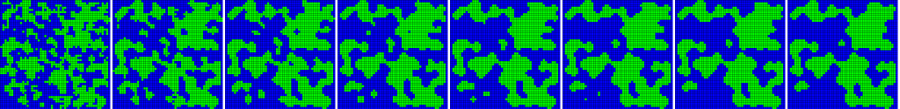
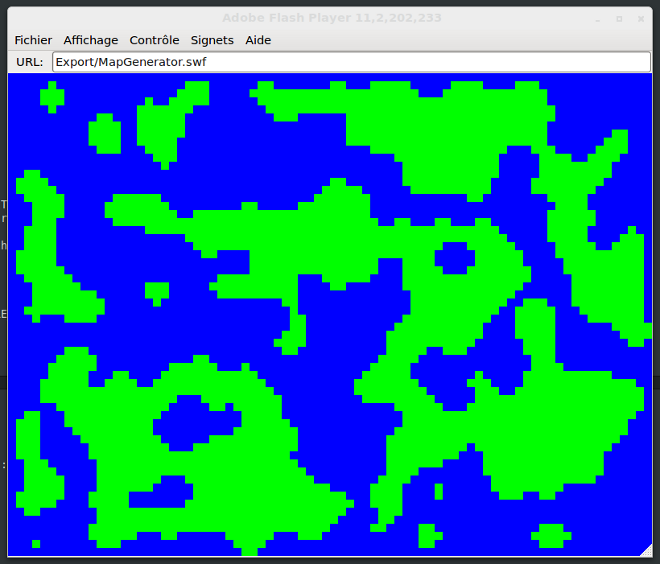

Cette méthode est utilisée dans beaucoup de domaines comme par exemple les maths, la physique...

Elle consiste à avoir une grille contenant des cellules, **chacune ayant un état** (dans notre cas eau/terre).

Pour chaque cellule, on regarde **l'état des cellules voisines pour déterminer son nouvel état**. Si une cellule est entourée d'au moins 5 cellules de type terre, alors la cellule est transformée en cellule terre, sinon on la passe en cellule de type eau.

Voici un exemple en 8 passes :

> Pour plus de renseignements sur cette méthode : [Cellular Automaton](http://en.wikipedia.org/wiki/Cellular_automaton) (ou Automate Cellulaire en français).

Il y a **deux façons** de procéder lors du traitement des données :

* Pour chaque cellule, faire le traitement et **modifier directement les données du tableau** (et donc prendre le nouvel état en considération lors du traitement de la cellule suivante)
* On traite les données à un **instant t**.

C'est cette **deuxième solution** que nous allons utiliser.

## Génération aléatoire du tableau ##

Dans un premier temps, nous devons donc **générer aléatoirement** des données dans notre tableau initial.

Pour ce faire, nous avons besoin d'un **ratio** pour nos cellules de type terre.


public static var LAND_RATIO : Float = 0.50;


Nous avons besoin d'un enum listant **les états possibles** pour chaque cellule (seul l'enum sera utilisé, le reste servira lors de l'affichage des données) :


package ;

enum CellType {
    land;
    water;
}

class CellTypes implements haxe.Public
{
    /**
     * Retourne la valeur sous forme de chaîne
     * de caractères pour un type donné
     */
    static function toString( t: CellType ) : String
    {
        return switch(t)
        {
            case land : 'land';
            case water : 'water';
        }
    }

    /**
     * Retourne la couleur pour un type donné
     */
    static function toColor( t: CellType ) : UInt
    {
        return switch(t)
        {
            case land : 0x00ff00;
            case water : 0x0000ff;
        }
    }
}


Puis nous générons les données :


var cells : Array< Array< CellType > > = new Array();
for (i in 0...MAP_WIDTH)
{
    cells[i] = new Array();
    for(j in 0...MAP_HEIGHT)
    {
        if(Math.random() < LAND_RATIO)
            cells[i][j] = CellType.land;
        else
            cells[i][j] = CellType.water;
    }
}


Nous avons maintenant un **tableau complètement aléatoire**. Il nous faut alors le traiter pour obtenir un terrain qui nous va bien.

## Traitement de données ##

Pour ce faire, nous devons définir un nombre d'itérations déterminant **le niveau de nettoyage** de notre terrain :


for(i in 0...5)
    cleanLand();


Et voici notre méthode de traitement de chaque cellule. Comme nous l'avons dit plus haut, le traitement se fait **à un instant t**. Nous avons donc besoin d'un tableau temporaire pour stocker nos nouvelles valeurs le temps de finir le traitement global du terrain :


private function cleanLand():Void
{
    for (i in 0...MAP_WIDTH)
    {
        for (j in 0...MAP_HEIGHT)
        {
            if(getAdjacentType(i, j, CellType.land) >= 5)
                tmpValues[i][j] = CellType.land;
            else
                tmpValues[i][j] = CellType.water;
        }
    }
}


Cette méthode retourne **pour une cellule donnée le nombre de cellules du type spécifié** en paramètre (le type de la cellule traitée est également pris en compte) :


private function getAdjacentType(col:Int, row:Int, lookFor:CellType):Int
{
    var found:Int = 0;
    for (i in -1...2)
    {
        for (j in -1...2)
        {
            // Une cellule null est prise en compte comme une cellule de type eau
            if (landArray[col + i] != null && landArray[col+i][row+j] == lookFor
               || (landArray[col + i] == null || landArray[col+i][row+j] == null) && lookFor == CellType.water)
                ++found;
        }
    }
    return found;
}


Voici un exemple de résultat :

La méthode pour obtenir un terrain utilisable dans un **donjon** (où toutes les cellules de type terre doivent être liées) est la même, mais il vous sera nécessaire de faire des **traitements supplémentaires**.

Le plus simple, sur un résultat comme celui ci-dessus, est de faire en sorte de **reconnecter toutes les parties**. Dans un premier temps, il faut augmenter **le ratio de cellule de type terre**, et le passer à 60% pour avoir quelque chose qui ressemble plus à un donjon. Et enfin, refaire quelques itérations pour supprimer (ou connecter, au choix) les parties ne l'étant pas encore.