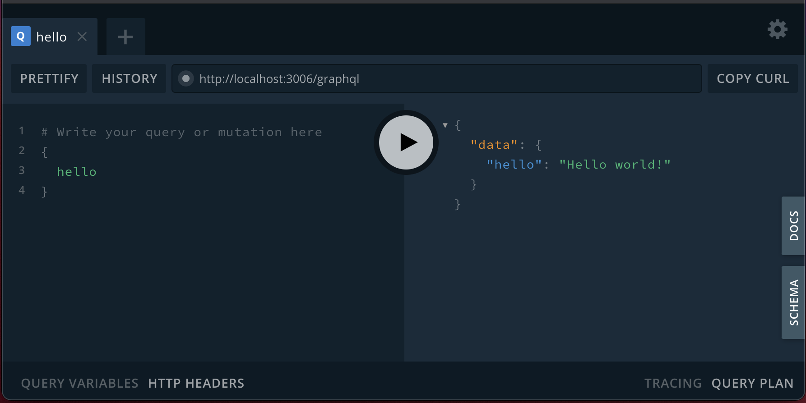
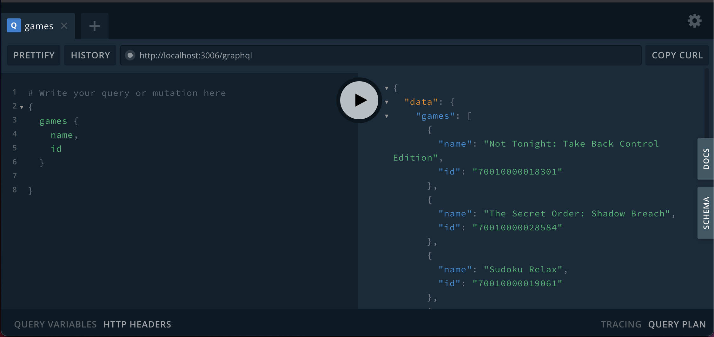

> This is not an in depth tutorial, if you want to follow a step by step guide, have a look at the official <a href="https://www.apollographql.com/docs/apollo-server">documentation here</a>.

The goal of this exercise was for me to investigate/discover how hard/easy it would be to start using GraphQL.

Lets create an Apollo Server with NodeJS so we can play with GraphQL. The server will distribute data retrieved from the nintendo eshop (cause why not `¯\_(ツ)_/¯`).

## Quick setup

#### Create the project

```
mkdir graphql-server-example
cd graphql-server-example
```

#### Initialise NodeJS

```
npm init --yes
```

#### Add the dependencies 

```
npm install apollo-server-express express
```

#### Create the base code

Copy/paste the following into an `index.js` file.


const express = require('express');
const { ApolloServer, gql } = require('apollo-server-express');
 
const typeDefs = gql`
  type Query {
    hello: String
  }
`;
 
const resolvers = {
  Query: {
    hello: () => 'Hello world!',
  },
};
 
const server = new ApolloServer({ typeDefs, resolvers });
 
const app = express();
server.applyMiddleware({ app });
 
app.listen({ port: 3006 }, () =>
  console.log('Now browse to http://localhost:3006' + server.graphqlPath)
);


Run `node index.js` and you'll have access to GraphQL Playground at `http://localhost:3006/graphql`



## Lets play

Lets define our types now. So we need to add a type to our `typeDefs`:


type Game {
  id: String
  name: String
  releaseDate: String
}


And we need to change our Query to return a list of games:


type Query {
  games: [Game]!
}


For this to work we obviously need to do a http request in order to get all titles.
That's when we need to define a `datasource` ([doc here](https://www.apollographql.com/docs/apollo-server/data/data-sources)).

First install `npm install apollo-datasource-rest`.


const { RESTDataSource } = require('apollo-datasource-rest');

class EshopAPI extends RESTDataSource {
  constructor() {
    super();
    this.baseURL = 'https://ec.nintendo.com/api/GB/en/';
  }

  async getAllGames() {
    const { contents } = await this.get('search/sales', {
      "count": 10,
      "offset": 0,
    });
    return Array.isArray(contents) ? contents.map(game => ({
      id: game.id || 0,
      name: game.formal_name,
      releaseDate: game.release_date_on_eshop
    })) : [];
  }
}

module.exports = EshopAPI;


Now go back to the main file to specify it in the ApolloServer constructor:


const dataSources = () => ({ eshopAPI: new EshopAPI() });
const server = new ApolloServer({ typeDefs, resolvers, dataSources });


And now you can get the list of games:



If you want more GraphQL example, look at the [SpaceX tutorial](https://www.apollographql.com/docs/tutorial/introduction/) which uses a REST API and a SqlLite DB.