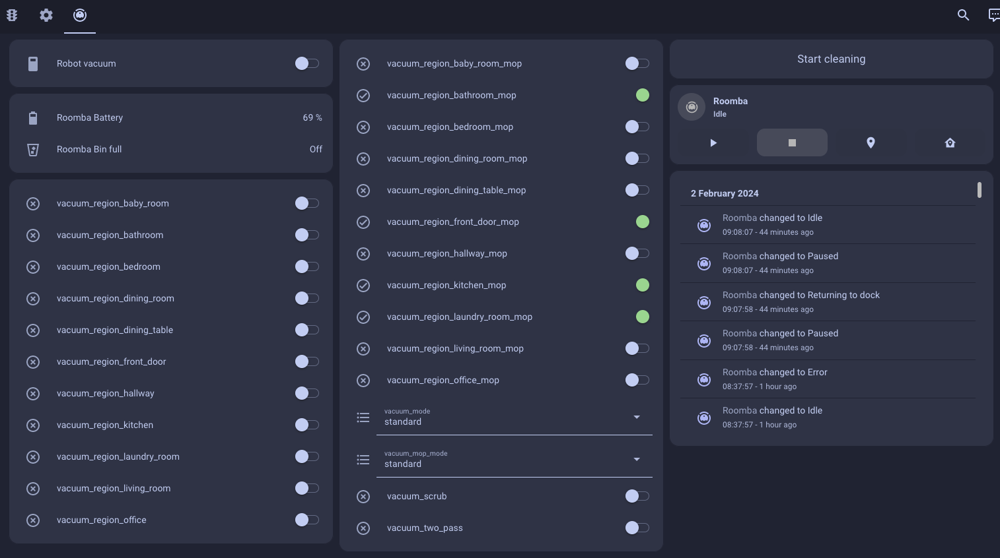
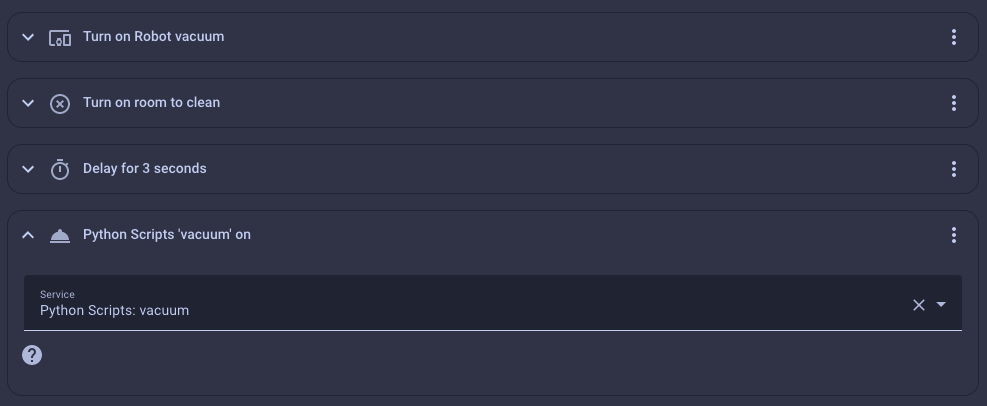

I recently acquired a Roomba j9+ from iRobot. While it's an excellent vacuum robot, I found the accompanying app lacking, especially since it requires the vacuum to be online, and the robot has a camera—an aspect I'm not particularly fond of.

To overcome these limitations, I decided to integrate my Roomba into my Home Assistant setup. However, due to a recent iRobot update, the local API no longer provides map data. This article outlines a Python script-based solution I devised for seamless integration.


## Prerequisites

Before we dive into the script, there are a few essential prerequisites:

1. **Map and Room Configuration:**
   - Ensure you have created the map and defined different rooms using the official iRobot app.

2. **Dorita980 Library:**
   - We will use the [dorita980](https://github.com/koalazak/dorita980) library to interact with the Roomba. This JavaScript library also helps us retrieve commands sent to the robot. To keep things straightforward, we'll run it in a custom Node.js app or a Docker container. More info [here](https://github.com/koalazak/dorita980?tab=readme-ov-file#how-to-get-your-usernameblid-and-password).


## Retrieving necessary data

With the prerequisites in place, follow these steps to get the required map and room IDs:

### Install dorita980

```bash
npm install dorita980
```

### Get Credentials

```bash
npm run get-roomba-password-cloud
```

This command will provide your BLID and password, crucial for Home Assistant integration.

### Retrieve Map and Room IDs

```javascript
// index.js
const BLID = 'YOUR_BLID';
const PASSWORD = 'YOUR_PASSWORD';
const ROBOT_IP = 'YOUR_ROBOT_IP';

const dorita980 = require('dorita980');
const robot = new dorita980.Local(BLID, PASSWORD, ROBOT_IP);

robot.on('connect', () => {
    robot.getRobotState().then((state) => {
        console.log(state.lastCommand);
    });
});
```

Start the job from the iRobot app, close the app from your mobile and run:

```bash
node index.js
```

> Note: if you installed the HA iRobot extension before these steps:
> As per this [comment](https://github.com/pschmitt/roombapy/issues/10#issuecomment-924239928), make sure the `Continuous` option is NOT enabled in HA integration.
> Don't forget to turn it back on once you are done.

You'll get something like:

```json
{
    command: 'start',
    pmap_id: 'YOUR_MAP_ID',
    user_pmapv_id: 'YOUR_USER_MAP_ID',
    regions: [
        { params: {}, region_id: 'YOUR_ROOM_ID', type: 'rid' },
        { params: {}, region_id: 'YOUR_ZONE_ID', type: 'zid' },
    ]
}
```

> Note: If you decide to edit the map, the `user_pmapv_id` will change, so you'll need to update it.

### Install the iRobot extension

Add the officiel HA integration for iRobot ([here](https://www.home-assistant.io/integrations/roomba/)) and log in to your robot using the credentials.

## The script

Back to the main topic: the script.

In order to have a better control from the UI, I've decided to create a couple of helpers:
 - `vaccum_room_[the name of the room]` this is a toggle that will trigger a job in a specific room
 - `vaccum_room_[the name of the room]_mop` this is also a toggle, but this will tell the robot to also mop the room

We also need a couple of other helpers for the various modes and options we can set on the robot:
 - `vacuum_mode`: quiet | normal | powerful (dropdown)
 - `vacuum_mop_mode`: eco | standard | ultra (dropdown)
 - `vacuum_scrub`: true | false (toggle)
 - `vacuum_two_pass`: true | false (toggle)

There're a couple of other options we could set, but I don't use them, so they are hardcoded in the script.

<script src="https://gist.github.com/po8rewq/b99c16b4f1452d1fcd88aeb5669cc37f.js"></script>

## How to use it

Two ways of using it, you can either change the toggles, and call the script from the UI, or you can create an automation.



Now if you want to create an automation, you can use the `input_boolean` and `input_select` helpers to set everything up, and call the script when everything is ready.



For my specific needs:
 - I turn on the plug
 - I change the toggles to true for the room I want to clean
 - I wait for 3 seconds (just to make sure the script has time to get the new state)
 - I call the script

This automation is triggered by a calendar event, so I can schedule the cleaning easily.