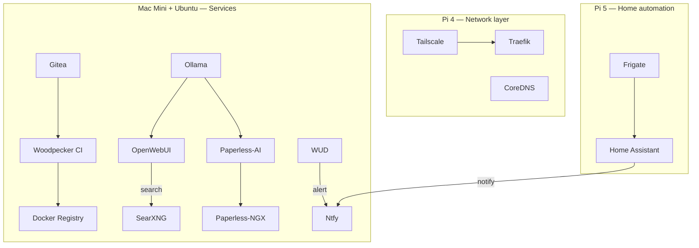

I'm not going to make the case for self-hosting here. If you're reading this, you already get it. What I want to do instead is be honest about what I actually run, why I made the specific choices I made, and - more interestingly - how the pieces talk to each other in ways that weren't always planned from the start.

In short: my 2026 homelab runs on a mix of Raspberry Pis, a Mac Mini, and an Ubuntu mini PC. Traefik handles routing, Tailscale provides remote access, Prometheus watches the stack, Ntfy connects notifications, and local AI runs through Ollama and OpenWebUI.

The stack runs across four machines. The bulk of Docker workloads are split between a Mac Mini and an Ubuntu mini PC. Network infrastructure - Traefik and CoreDNS - runs on a Raspberry Pi 4, which also handles the NUT server for UPS management; keeping the network layer on its own always-on hardware means a container crash elsewhere doesn't take down routing or DNS. Home Assistant runs on a Raspberry Pi 5 with the Hailo 8 AI HAT. [Frigate](https://frigate.video/) runs alongside it as a Home Assistant add-on, which is what gives it direct access to the Hailo 8 for hardware-accelerated camera object detection - no GPU needed in the main machines for that workload.

The mental model that makes sense of the whole thing: everything gets served through Traefik, everything ships metrics to Prometheus, and Ntfy acts as the notification bus that ties async events together. Most of the rest are applications that plug into those three rails.

| Category | Tools |
|---|---|
| Network | Tailscale, Traefik, CoreDNS |
| Dev & CI/CD | Gitea, GitHub, Woodpecker CI, Docker Registry, WUD |
| AI | Ollama, OpenWebUI |
| Search | SearXNG |
| Documents | Paperless-NGX, Paperless-AI |
| Passwords | Vaultwarden |
| Monitoring & management | Prometheus, Portainer, Homer |
| Notifications & sharing | Ntfy, Pairdrop |
| Home automation | Home Assistant, Frigate |

## The foundation

### Traefik

Everything HTTP goes through [Traefik](https://traefik.io/traefik/). It's the reverse proxy in front of every Docker-hosted service, and the main reason I chose it over Nginx or Caddy is Docker-native autodiscovery. When I bring up a new container with the right labels, it appears behind a subdomain with automatic TLS, no config file reload required. That removes enough friction that I'm less tempted to leave things running unproxied on bare ports.

Traefik handles Let's Encrypt certificate issuance and renewal. Services that aren't on the public internet use a DNS-01 challenge, so they get valid certs without being exposed to the web. The rest of the stack is effectively Traefik labels plus container configs all the way down.

### Tailscale

[Tailscale](https://tailscale.com/) is how every machine in the stack is reachable from outside the local network. All four machines are on the same Tailnet, which means I can reach any service from anywhere without opening ports or maintaining a VPN server.

> [!NOTE]
> Tailscale isn't fully self-hosted — the coordination server is Tailscale's. The traffic itself is peer-to-peer and never leaves the devices, but the key exchange goes through their infrastructure. For a homelab, that trade-off is easy to accept; for stricter control, [Headscale](https://headscale.net/) is the self-hosted alternative.

### CoreDNS

[CoreDNS](https://coredns.io/) handles local name resolution. All internal subdomains resolve to the local machine without ever leaving the network, which means Traefik's label-based routing is actually usable on every device without editing hosts files or relying on split-horizon DNS from the router. CoreDNS sits upstream of the system resolver and forwards anything it doesn't own to the public DNS of choice. It's invisible when it works, which is most of the time.

## Dev & CI/CD: the pipeline

This is where the most deliberate architecture lives, because I wanted something that felt like a real deployment pipeline rather than manually building and copying images around.

### Gitea

[Gitea](https://about.gitea.com/) is where all private repositories live: infra configs, personal projects, anything I don't want on a third-party server. Public projects still go to [GitHub](https://github.com) because that's where the audience is, but a number of those GitHub repositories are mirrored back to Gitea as a local backup. The split is simple: Gitea for control and resilience, GitHub for reach.

### Woodpecker CI

[Woodpecker CI](https://woodpecker-ci.org/) is the pipeline runner, hooked directly into Gitea webhooks. Push to a branch, a pipeline runs. The config lives as a `.woodpecker.yml` at the repo root, which means pipeline definitions are versioned alongside the code. Woodpecker builds Docker images and pushes them to a local registry on the same host.

### Local Docker registry

A plain Docker registry container, served behind Traefik. Woodpecker pushes here; `docker compose` pulls from here. Keeping images local means builds are fast, no rate limits, and nothing depends on an external registry being up. Not sophisticated. Exactly as much complexity as needed.

### WUD - What's Up Docker

[WUD](https://getwud.github.io/wud/) watches running containers and detects when upstream image versions are newer than what's deployed. It doesn't auto-update by itself in my setup, I use it as a detection layer. When it spots a new version, it fires a notification through Ntfy, which I'll get to shortly. The result is that upstream updates surface as notifications I can act on rather than surprises I discover when something breaks.

## Local AI: Ollama + OpenWebUI

I run [Ollama](https://ollama.com/) for local model inference. The main draws are the obvious ones: no data leaves the machine, no per-token cost, models available offline. Local models cover summarization, document classification, and general Q&A; tasks where a smaller model is good enough and keeping data local matters.

Code assistance is the clear exception: small models aren't reliable enough there, so that goes to cloud APIs - Claude or Codex depending on the task. [OpenWebUI](https://openwebui.com/) makes the split seamless: it sits in front of Ollama but also accepts API keys for cloud providers. In practice I open one interface and pick a model from a dropdown rather than switching tools. Local by default, cloud when it's actually worth it.

OpenWebUI also connects to SearXNG as a search tool, which means it can pull current information without phoning home to a commercial search provider.

## Search: SearXNG

[SearXNG](https://docs.searxng.org/) is my default search engine on all devices. It's a meta-search engine. It queries multiple sources and aggregates results. But the key property is that queries don't get tied to an account or used to build a profile. Results are good enough for 95% of searches, and for the other 5% I have a single click to fall back to whatever source I want.

The setup is minimal: one container behind Traefik, set as the default search engine in the browser. It's one of those things that took twenty minutes to deploy and I've never thought about since.

## Documents: Paperless-NGX + Paperless-AI

[Paperless-NGX](https://docs.paperless-ngx.com/) handles all document management. Scan or drop a PDF into the inbox, it gets OCR'd, indexed, and stored. The tagging and correspondent system means I can find anything in seconds rather than digging through a folder hierarchy.

On top of that I run [Paperless-AI](https://github.com/clusterzx/paperless-ai), which hooks into the Paperless-NGX API and uses a local Ollama model to automatically suggest tags, correspondents, titles (and various other custom properties) as documents come in. This closes a loop with the AI section: Ollama isn't just a chat model, it's doing practical classification work for real files. The whole thing runs locally, so no document content touches an external service.

## Password management: Vaultwarden

[Vaultwarden](https://github.com/dani-garcia/vaultwarden) is a self-hosted Bitwarden-compatible server. All credentials live locally, sync across devices through the standard Bitwarden clients, and never touch a third-party server. It's one of those services where the self-hosted case is unusually strong: the upstream Bitwarden clients are excellent, Vaultwarden is a drop-in replacement, and keeping your password vault on your own hardware removes a meaningful point of trust.

> [!TIP]
> A password vault is the one thing you cannot lose and cannot recover from a partial backup. I wrote a [dedicated post about the backup architecture](/p/backing-up-the-one-credential-that-cant-be-wrong/) covering how I handle this specifically for Vaultwarden.

## Monitoring & management

### Prometheus

[Prometheus](https://prometheus.io/) scrapes metrics from the stack. Node exporter covers the host, cAdvisor covers containers, and individual services expose their own endpoints where supported. The main value isn't dashboards (though those exist) - it's having a queryable record of system state over time, and a place to hook alerts when something drifts.

### Portainer

[Portainer](https://www.portainer.io/) is the visual management layer. I use it for quick container inspection, pulling logs, and managing stacks without SSHing in every time. It doesn't replace Prometheus, they have different jobs. Prometheus tells me what happened and when; Portainer tells me what's running right now and lets me poke at it.

### Homer

[Homer](https://github.com/bastienwirtz/homer) is a static dashboard - a single page with links to every service, configured via a YAML file. It's the least technical piece in the stack and the one my family actually uses. Rather than memorizing subdomains or digging through bookmarks, everyone has Homer as a home page: a clean grid of icons that opens whatever they need. The split between Portainer and Homer is intentional - Portainer is for me, Homer is for everyone else.

## Communication & file sharing

### Ntfy

[Ntfy](https://ntfy.sh/) is the thread that ties the whole async event model together. It's a self-hosted push notification server. HTTP `POST` to a topic, and every subscribed client gets a notification. Woodpecker sends build results here. WUD sends image update alerts here. Home Assistant sends automation notifications here. Having one place where things send notifications means I can manage subscriptions in one app and stop checking dashboards compulsively.

The pattern is simple enough that anything can use it: if a script or service needs to tell me something happened, it makes an HTTP request. No SDK, no auth complexity, just a POST.

### Pairdrop

[Pairdrop](https://pairdrop.net/) is AirDrop for the local network, any device on the LAN can discover others and transfer files peer-to-peer through the browser. No account, no cloud relay, no app install. I use it constantly for moving files between phone, laptop, and desktop without thinking about it.

## Home automation: Home Assistant

[Home Assistant](https://www.home-assistant.io/) is the one thing in the stack that runs on bare OS rather than Docker. It's Home Assistant OS on a dedicated Raspberry Pi 5, which is a deliberate choice: the add-on ecosystem, hardware device support, and the supervisor layer all work better outside a container. Trying to run it in Docker introduced enough friction with USB devices and networking that the clean answer was to give it its own machine.

[Frigate](https://frigate.video/) runs as a Home Assistant add-on rather than a standalone container, and that placement matters: it gives Frigate direct access to the Hailo 8 AI HAT on the Pi 5 for hardware-accelerated object detection on camera streams. Running it as an add-on keeps the integration tight and avoids the networking gymnastics that come with trying to expose a hardware accelerator across container boundaries.

It integrates back into the rest of the stack through Ntfy, automations that need to notify me fire an HTTP call to the same notification server everything else uses. One less thing to configure separately.

## What's next

One thing I'm actively removing is n8n. On paper it's a great fit — nice UI, trivial to set up, an enormous library of nodes. In practice, for the automations I actually run, it's massively oversized. A tool that big has a way of becoming its own maintenance surface, and when I look at what I'm using it for, most of it is simple enough to replace with a script and an HTTP call to Ntfy. Sometimes the right answer is less, not more.

The stack has been stable enough that I've been iterating on individual services rather than adding new ones. The pieces that took the most time to get right were the CI/CD pipeline (getting Woodpecker, the local registry, and WUD to work as a coherent unit) and Paperless-AI (tuning the prompts so document classification is actually useful rather than just technically running).

If any of this is useful as a starting point, most of these services have reasonable official documentation and active communities. The architecture isn't novel, it's mostly standard self-hosting patterns assembled with some thought about how the parts should talk to each other.
