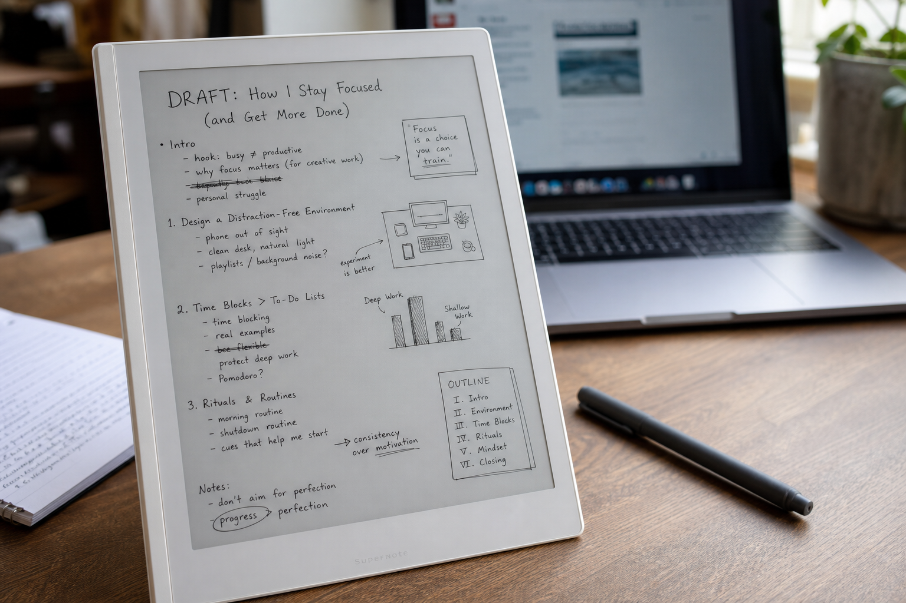

In a recent meeting, I noticed something familiar happen again.

While everyone else stayed inside docs, tickets, and browser tabs, I was filling page after page on my Supernote: arrows between ideas, underlined decisions, a rough architecture sketch in the margin, and a few questions to come back to later. By the end of the conversation, I did not have polished notes. I had something more useful: a map of how I understood the problem.

That pattern shows up everywhere in my work.

I do not use the Supernote as my primary note repository. Every note eventually ends up in Obsidian. The Supernote serves a different purpose: it is where ideas begin.

Almost everything I write starts there.

> The Supernote is not where my notes live. It is where my ideas become clear.

## The Supernote Is My Thinking Device

When people talk about digital note-taking devices, they often focus on organization.

For me, organization happens later.

The Supernote is where I dump ideas, explore solutions, sketch architectures, and work through problems. It is where I write things that do not yet have a clear structure.

Sometimes it is meeting notes. Sometimes it is a rough outline for a blog post. Sometimes it is pages of random thoughts while trying to understand why a system behaves in a certain way.

The common thread is that I am using handwriting to think.

There is something about writing by hand that slows my brain down just enough to make connections I would otherwise miss.

## Meetings Start Here

Most of my meeting notes are taken on the Supernote.

I do not try to create perfect documentation during meetings. Instead, I focus on capturing information quickly:

* Decisions
* Action items
* Questions
* Technical details
* Follow-up topics

The goal is not to produce a polished document. The goal is to stay engaged in the conversation while preserving the important information.

After the meeting, the notes become part of a larger workflow.



*A typical page starts messy: fragments, arrows, quick diagrams, and just enough structure to make the next step obvious.*

## From Supernote to Obsidian

Every note eventually finds its way into Obsidian.

My process is fairly simple:

1. Write notes on the Supernote.
2. Export them as PDF.
3. Run OCR locally using Ollama.
4. Import the resulting text into Obsidian.
5. Organize and connect the information with the rest of my knowledge base.

```text
Supernote -> PDF export -> local OCR -> Obsidian -> linked notes
```

That OCR step matters more than it might sound.

It is not perfect, especially when my handwriting gets messy or a page is full of diagrams and fragments. But it is good enough to turn rough handwritten thinking into searchable text without sending private notes to a cloud service. Once the text is in Obsidian, I can clean it up, link it to related notes, and decide what is worth keeping.

This gives me the best of both worlds.

I get the flexibility and freedom of handwriting during the thinking phase, while still benefiting from searchability, linking, and long-term knowledge management inside Obsidian.

The Supernote captures ideas.

Obsidian preserves them.

## Debugging on Paper

One of the most valuable uses of the Supernote has been debugging.

Whenever I encounter a difficult problem, I often stop looking at the screen and start writing.

I draw system diagrams. I map data flows. I write assumptions. I list hypotheses. I document failed attempts.

Many times, the act of writing reveals gaps in my understanding that were not obvious while staring at logs or source code.

The Supernote has effectively replaced the whiteboards and notebooks I used in the past.

## Gathering Thoughts Before Writing

Most of my articles start as handwritten notes.

Not because handwriting is faster. It is definitely slower.

But that is exactly why it works.

Writing by hand forces me to think about what I am trying to say before I say it.

Instead of immediately producing paragraphs, I build a structure:

* Main idea
* Supporting points
* Examples
* Counterarguments
* Conclusions

By the time I open my editor, most of the hard part has already happened.

The writing is no longer about discovering what I think. It is about shaping it.

## Organized Chaos

If someone opened my Supernote, they would probably be confused.

Many pages contain incomplete sentences, arrows pointing in every direction, diagrams, random observations, and fragments of ideas.

That is intentional.

The Supernote is not where I create finished work.

It is where I create clarity.

The messy notes eventually become technical documentation, blog posts, project plans, or meeting summaries. Before they become structured documents, they are simply thoughts on a page.

## Two Tools, Two Jobs

I have realized that my workflow has two distinct phases:

The first phase is thinking.

The second phase is storing and organizing knowledge.

The Supernote excels at the first.

Obsidian excels at the second.

Trying to force one tool to do both has never worked particularly well for me.

By separating the thinking process from the knowledge management process, I have ended up with a workflow that feels natural and sustainable.

Almost everything I write starts with the Supernote.

Not because that is where the final version lives.

When I need a durable system, I use Obsidian. When I need to understand something, prepare to write, or find my way through a messy problem, I reach for the Supernote first.

That is probably the real lesson for me: the best tool is not always the one that stores everything. Sometimes it is the one that helps ideas take shape before they are ready to be stored anywhere at all.
