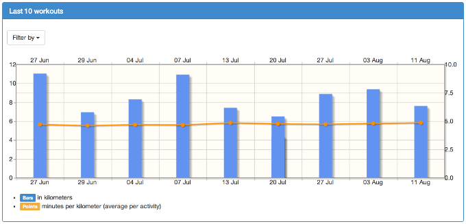
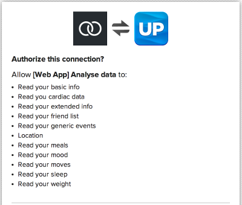

## Quick update ##

The application is now live, you can test it if you have a Jawbone UP account (and the Jawbone wristband of course).

So now the application lets your track your 10 last workouts :

For now it only works on running activities. It lets you track the number of kilometers you've run, and for each workout the speed average.

The app is accessible [here](/jawboneUp/index.php).

## Authorization ##

To access the application you'll need to authorize the following :

Don't be afraid, there is no data stored on this app.

> This application is still under development