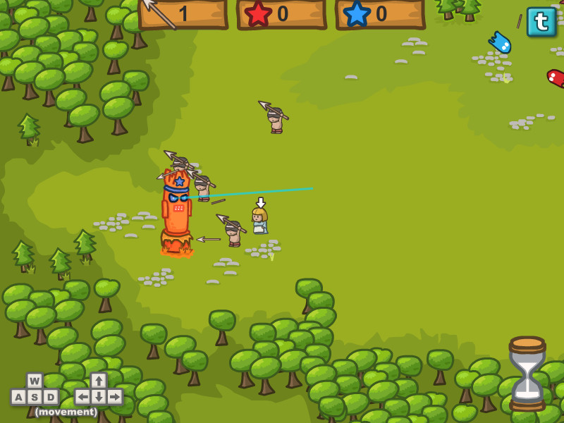
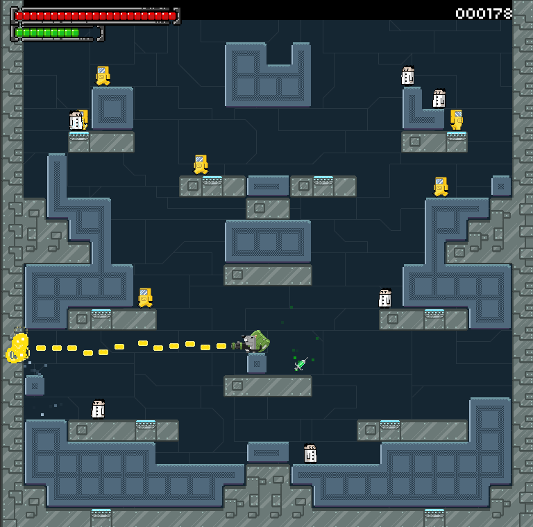
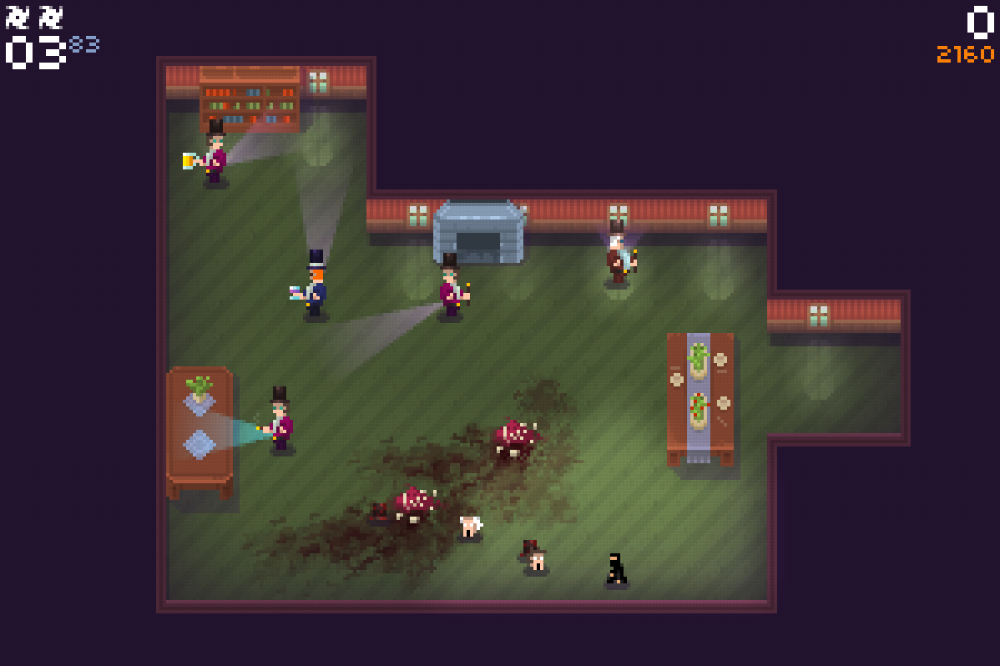
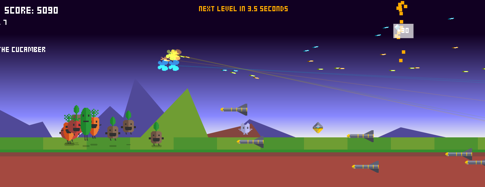
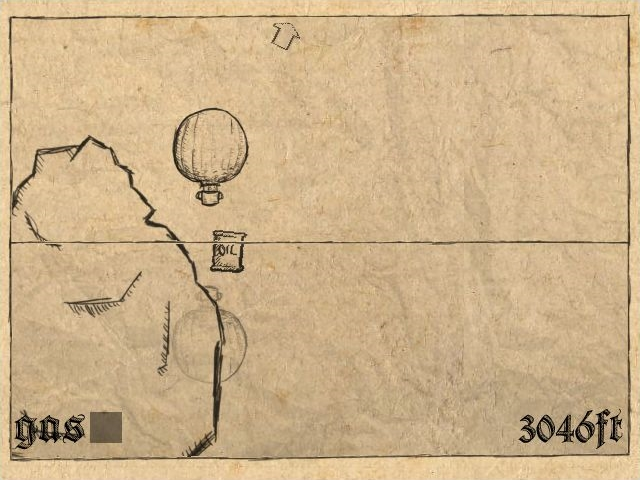

Since I couldn't take part to the <a href="http://ludumdare.com/compo">Ludum Dare #27</a>, I've selected some games I liked.
There always is plenty of <strong>great concepts</strong> made during this few hours, I can't play and speak about all of them, so I've selected <strong>5 games</strong> that I like more (a least so far) :

The theme was <strong>10 seconds</strong>.

## The Village of Lost Time by EpaceGames

You play a Native American trying to save his daughter by destroying evil totems.
Each turn last <strong>10 seconds</strong>, and is <strong>repeated</strong> in the next one.
For example, the gatherer is going to take javelins in the 1st round, in the 2nd round, the same action will be repeated, and you will have to play with another person.
<strong>Three class</strong> are available, depending of the resources you've collected.
The concept is great and so is the graphic style. At first, it's a little bit hard to understand what has to be done, but after that, it's just fun.

The Village of Lost Time by EpaceGames[/caption]

## Subject 18120 by deammer

A 2D shoot them up, between <a href="http://www.supercratebox.com/" target="_blank">super crate box</a> and <a href="http://andrewmorrish.net/?page_id=313">super puzzle platformer</a>. You play a rat that just escaped a research lab, and wants revenge. The speech is <strong>classic</strong>, but the realization is good. The <strong>pixel art</strong> style is really great too. Nothing to say about controls. <strong>Great job</strong> !
There are many sorts of weapons with different effects given randomly, everything is here to have some fun. You only have drugs for <strong>10 seconds</strong>, after that, your life is going to be sucked down.

Subject 18120 by deammer

## Proletarian Ninja X by Deepnight

Deepnight is one of these guys that always end up with a great game at each Ludum Dare.
Even if he says he gives up 24 hours before the end :D

> <a href="https://twitter.com/search?q=%23ld48&amp;src=hash">#ld48</a> Gave up :(
> &mdash; Sébastien Bénard (@deepnightfr) <a href="https://twitter.com/deepnightfr/statuses/371326062929530881">August 24, 2013</a>

In this game, you are going to control a ninja ; you have to destroy every enemy but with <strong>10 seconds</strong> on each contract, you have to hurry.
Controls are fun, the graphic style is, as usual, nice, with the same pixel effect as the older games.
The levels are fun and the difficulty increases, so it’s fun to play.

Proletarian Ninja X by Deepnight

## Potato Lagoon by Rezoner

It's a shoot them up with vegetables and butterflies ... okay ... that saying, each level changes after <strong>10 seconds</strong>. The graphic style is cute and as usual, the music is great (really great).
You can find upgrades to increase fire power, extra life, ...
The only problem is that I don't really like controls, I find them... weird I think, maybe they fit for mobile devices, I haven’t tested the Android version.

Potato Lagoon by Rezoner

## Gas and Air! by tripleVisionGames

You control an hot-air balloon, and you have only <strong>10 seconds</strong> of gas left, use it carefully to go as far as you can.
The graphic style is really cool, sounds are great. For sure, the theme fits but there’s nothing new.
The realization is great, there is power up, the game is neither too much or not enough difficult, just classic and well done.

 Gas and Air! by tripleVisionGames

## SMS Racing by hlink

I know, it's now the sixth game, but consider it as a bonus :D
Build on top of the <strong>Unity racing demo</strong>, <a href="http://www.ludumdare.com/compo/ludum-dare-27/?action=preview&uid=12997">SMS Racing</a> lets you send small messages while driving.
The goal is to complete a lap while texting messages each <strong>10 seconds</strong>.
I've selected this game just because of its message: <strong>it's dangerous to use your phone when driving !</strong>.

<iframe width="640" height="360" src="http://www.youtube.com/embed/w59lfV_000A?feature=player_embedded" frameborder="0" allowfullscreen></iframe>
