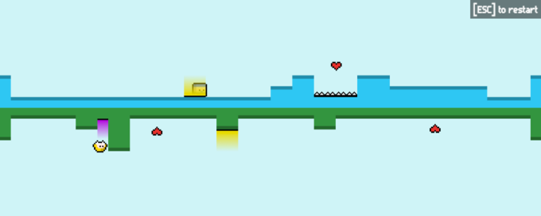

After quite some time since the last time I've joined the [Ludum Dare](http://www.ludumdare.com/compo/), I've submitted my game according to the theme : **Connected Worlds**.

The game is quite simple, lovers have to collect all the  to open the gate  to the next level. In some levels, you'll find switches  that can open one or more gates  when one of the player stands on it and of course, be carreful of the deadly traps .

## What went right

* The theme: I had a few ideas in mind
* The tools: when you're using tools you know, you don't have to lose time that you don't have ;)
* Not enough levels for a complete game, but enough for a 48 hours game

## What I can improve

* Work a little longer, I've tried to have a "normal" weekend at home (normal you said??)

## And the usual

* The design: I need to work on that
* No sound: so next time maybe I'll try if I have time and some motivation
* I had some difficulties to find cool levels

> You can play it <a href="/work/ld30-2lovers.html">here</a>.