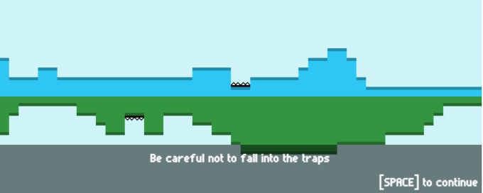

So far, I'm sort of happy with my [idea](/2014/08/23/ludumdare-im-in/).

I'm using [Tiled]("http://mapeditor.org") for the level design.

There is still a lot to do.

For now I've implemented those features :

 * Players can die (by falling into traps)
 * Collecting hearts
 * Opening of the gate when all the hearts are collected
 * Going to the next level when both players have reached the gate

