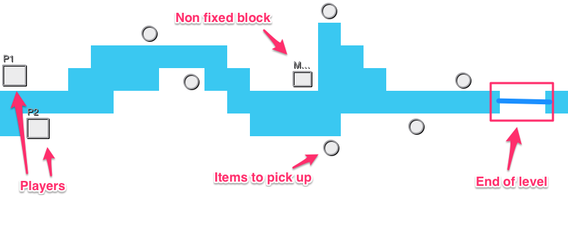

It's been quite some times since my last participation (more than a year actually).

So let's get started ! The theme is : **Connected worlds**

For those of you that don't know what the rules are, please check it out [here](http://www.ludumdare.com/compo/2014/04/25/rules-and-guide-re-written-for-maximum-clarity/).

## My tools

* Haxe + [AGE](https://github.com/po8rewq/AGE)
* Gimp

I'll push my code to [github](https://github.com/po8rewq/LD30).

## My idea

The player controls the two heros.

The goal for both heros is to go to the other world by picking up all items to open the gate.
