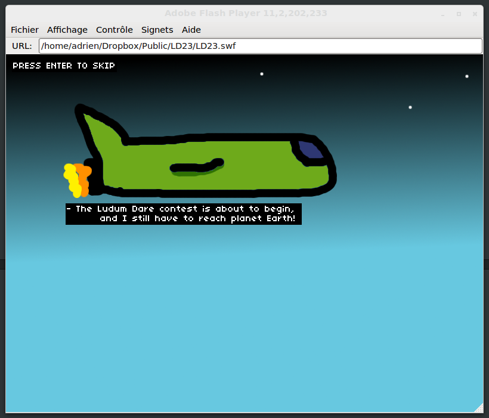
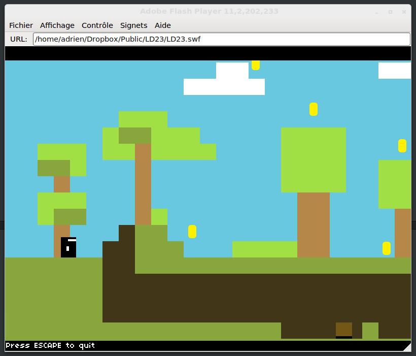

Last weekend, I entered the great contest that is [Ludum Dare](http://www.ludumdare.com/compo). For those who don't know what the Ludum Dare is, it's an event that takes place every 3 months, and that gathers a lot of people wanting to create games... in only **48 hours** for the solo contest, and around a **precise theme**. To give you an idea of the popularity of this contest, people submitted over **1200 games** during the weekend!

When the subject of this Ludum Dare has been announced (**Tiny World**), a lot of people started to post on the official website all their ideas, and that it was an inspiring subject ... but it wasn't my case. So I took 2 or 3 hours looking for a good idea and trying to have a good concept.

Thanks to the **coffee**, I managed to finish my game in time [to submit it](http://www.ludumdare.com/compo/ludum-dare-23/?action=preview&uid=4401) (click to see the entry). Its name ? **Pixel World** !

## How I prepared ##

* Trying concepts using <a href="http://haxepunk.com/">HaxePunk</a> to start learning this great tool
* Used <a href="http://www.mapeditor.org/">tiled map editor</a> with HaxePunk
* In fact, I prepared all the tools I needed

## What went right ##

* I tried to stay simple and to focus on the concept
* I used tools I was familiar with (HaxePunk, [MonoDevelop](http://monodevelop.com) and [Gimp](http://www.gimp.org)), so I didn't lose time on that
* Thanks to my **lack of drawing abilities**, I managed not to spend too much time on the graphic design (actually, it helped me to find a cool concept!)

## What could have been better ##

* More updates on my progress (I tried to stay away from the website, in order not to be distracted by watching the other's **amazing games**)
* I spent too much time on the level design : I tried to stay simple, but didn't want to have a game that was too simple to play...

## Next time ##

* I will try to add **sounds/music** to my game
* Much more updates on my work on the website
* **Less coffee** ? (just kidding... or am I?)

## Here's my work ##

> [Play the game](/work/pixel-world.html)