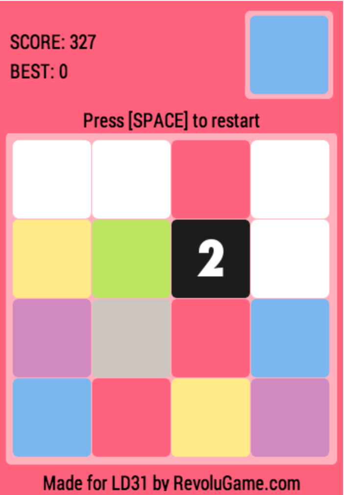
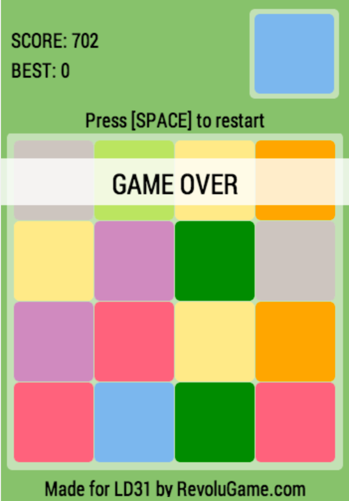
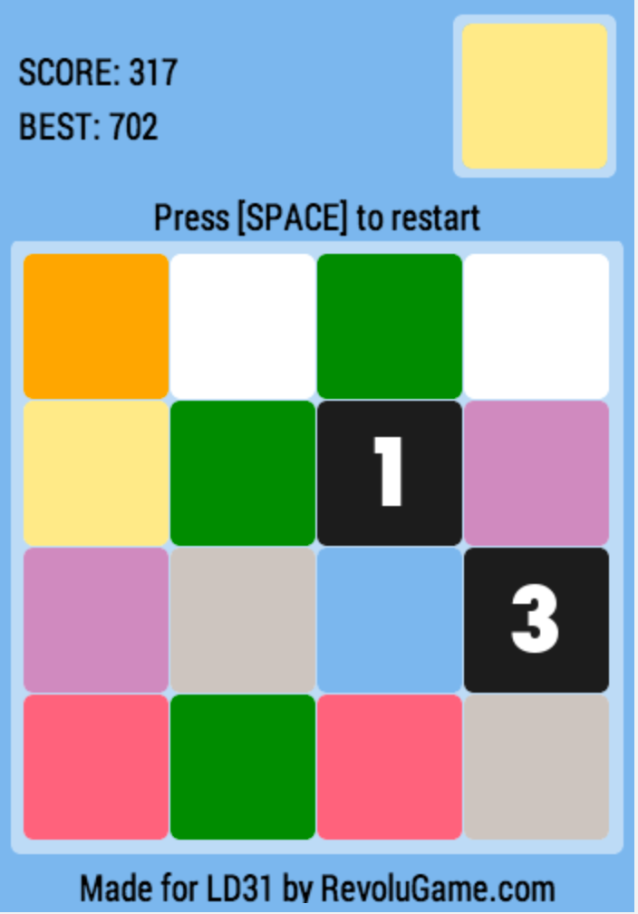

So here it is, my LD 31 entry is named **COLORING**.

It’s a simple puzzle game where you have to align at least two cards of the same color to unlock the next one. The game ends when there is no place left, and of course the main goal is to have the best score ;)

Check it out [here](/work/ld31.html).

Here are screenshots:

	
	
	

> Please let me know what you think about this game!