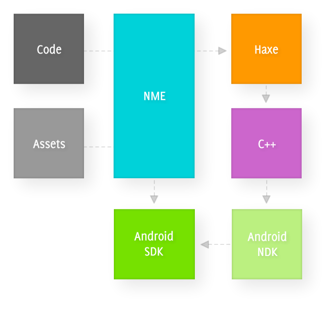

La version 3 de **NME** est enfin disponible sur **haxelib **!!

Le rêve de tout développeur est en train de se réaliser : developper une application, et la publier sur **toutes les plates formes** ! C'est enfin possible grâce à **haXe **et **NME**.

## Quelques précisions

Avant d'aller plus loin, voyons un peu de quoi il s'agit. Si vous êtes familié avec <a href="http://www.haxe.org/">Haxe</a>, vous ne l'êtes peut etre pas avec **NME**.

**NME **(pour Neko Media Engine) est un **framework open source** permettant de publier une application vers tout type de plate forme (windows, linux, android, ios, et j'en passe). Ce framework s'appui sur le langage **haXe**, ce qui permet d'avoir une syntaxe proche de l'**Actionscript**. **NME **s'occupe ensuite de mapper tout ca, et de publier pour la plate forme voulue.

Nous ne nous interresserons pour le moment, qu'à la plate forme **android**.

Voici un schéma permettant de comprendre le fonctionnement :

(source: <a href="http://www.haxenme.org/">www.haxenme.org</a>)

NME va utiliser le compilateur **haxe**, avec la librairie **HXCPP **pour générer les classes **C++**. La compilation va se poursuivre via le <a href="http://developer.android.com/sdk/index.html">SDK et le NDK Android</a>.

Et pour terminer, en passant par une tache <a href="https://ant.apache.org/">Ant</a>, le processus de compilation va se terminer et lancer (si besoin) l'installation sur le périphérique Android.

## Installation

Voici la liste des étapes à suivre pour avoir un environnement de travail fonctionnel. Je suis sous linux, mais sous n'importe quelle plate forme, l'approche reste à peu de chose prêt la même.

Tout d'abord, haxe : télécharger l'installeur sur le site <a href="http://haxe.org/download">haxe.org</a>, décompresser puis :


haxelib install hxcpp
haxelib install nme
haxelib install gm2d


Il nous faut maintenant récuperer le <a href="http://developer.android.com/sdk/index.html">SDK et le NDK android</a> (menu de gauche pour le NDK) :


wget http://dl.google.com/android/android-sdk_r12-linux_x86.tgz
wget http://dl.google.com/android/ndk/android-ndk-r6b-linux-x86.tar.bz2


Le JDK java :


sudo apt-get install openjdk-6-jdk


Et enfin, ant


sudo apt-get install ant1.8


Une fois que tout est téléchargé/installé, nous devons setter les variables d'environnements :


ANDROID_SDK
ANDROID_NDK_ROOT
ANDROID_HOST=linux_x86 [linux only]
JAVA_HOME=/usr/lib/jvm/java-1.6.0-openjdk


## Petite application de test ##

Le code :


package ;

import flash.display.Sprite;
import flash.display.StageAlign;
import flash.display.StageScaleMode;
import flash.geom.Rectangle;
import flash.Lib;

class Sample extends Sprite
{
    public function new()
    {
        super();

        Lib.current.stage.align = StageAlign.TOP_LEFT;
        Lib.current.stage.scaleMode = StageScaleMode.NO_SCALE;

        trace('Hello World');

        var rect : Sprite = new Sprite();
        rect.graphics.beginFill(0xFF0000);
        rect.graphics.drawRect(0, 0, 200, 200);
        rect.graphics.endFill();
        addChild(rect);
    }

    public static function main ()
    {
        Lib.current.addChild( new Sample() );
        #if nme
        Lib.current.addChild(new nme.display.FPS() );
        #end
    }
}


Le fichier de configuration (myConfigFile.nmml) :


<project>
    <app title="Sample from revolugame" main="Sample" />
 
    <window width="0" height="0" orientation="landscape" fps="60" background="0xffffff" resizeable="true" hardware="true" />
 
    <set name="BUILD_DIR" value="Export" />
    <classpath name="src" />
 
    <haxelib name="nme" />
 
    <target name="android" />
 
    <ndll name="std" />
    <ndll name="regexp" />
    <ndll name="zlib" />
    <ndll name="nme" haxelib="nme" />
</project>


Lancer la compilation :


haxelib run nme test myConfigFile.nmml android


L'option **test** correspond à **build** suivi de **run**, mais il est également possible de ne lancer que l'une de ces options.

Pour tester l'application en flash, suffit de remplacer **android** par **flash**.