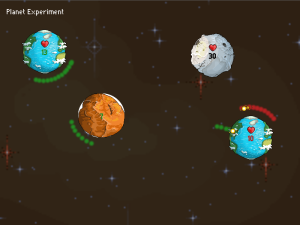

So now, it's officially the **1PAM** (one prototype a month).

It's a simple conquest game, my first targeting **HTML5**. So it was more an excuse to update my game engine, so that it can compile to **js**.

<a href="https://github.com/po8rewq/AGE">AGE</a> is still an <a href="http://haxe.org">Haxe</a> framework, but now <a href="http://nme.io">NME</a> is not required anymore.
The engine will be compatible Flash (again) soon.

<a href="/work/planets-experiment.html">Here is the link</a>, if you want to test it.

