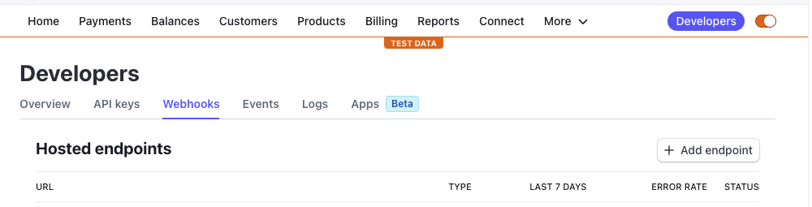
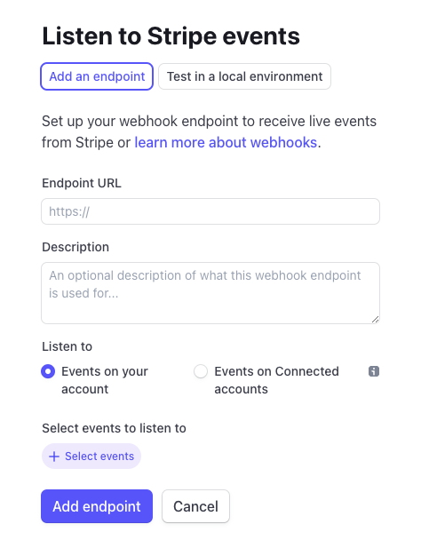
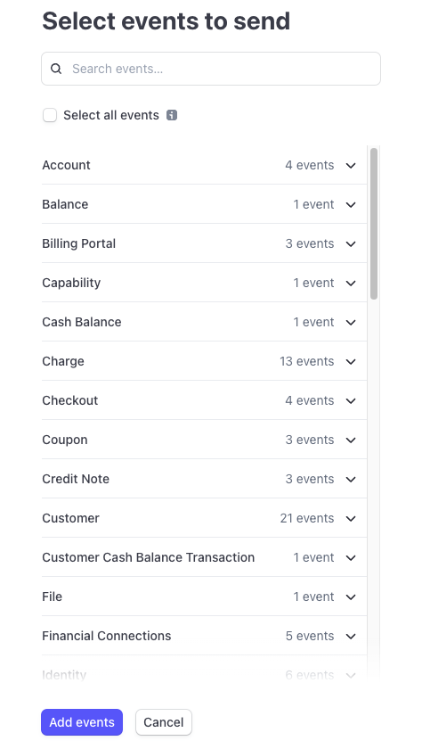

## Intro

Stripe webhooks enable receiving notifications when an event occurs in your stripe account, such as payment or subscription creation, customer creation, among others. 

Data received varies depending on the event: payment intent id, amount, currency, etc., for payment creation, for example.

This NextJS tutorial focuses on webhook management solely, not stripe integration for your application. Assuming that you have a stripe account and prior knowledge in payment intent or customer creation, we will cover setting up a webhook handler in NextJS.

## Setup webhook in Stripe

Go to your stripe dashboard, then click on the "Developers" tab, then on "Webhooks".



Then click on "Add endpoint".



The url is the url of your NextJS application. For instance, if your application is deployed on Vercel, it will be something like `https://your-app.vercel.app/api/webhooks`.

Then, you need to choose the events you want to listen to. For instance, if you want to listen to the `payment_intent.succeeded` event, you need to select "Payment intent succeeded" in the "Event types" dropdown.



Then click on "Add endpoint".

## Create a webhook handler

Lets jump right into the code. First, we need to create a handler that will be called when a webhook is received. We are going to create a file called `webhooks.ts` in the `pages/api` folder.

```typescript
// pages/api/webhooks.ts
import { buffer } from 'micro';
import { NextApiRequest, NextApiResponse } from 'next';
import Stripe from 'stripe';

// This part is necessary so that NextJS doesn't parse the request body
// Otherwise it will manipulate it and stripe will reject it
export const config = {
  api: {
    bodyParser: false,
  },
};

// the handler
const handleWebhook = async (
  req: NextApiRequest, 
  res: NextApiResponse
  ) => {
  if (req.method === 'POST') {
    try {
      // get the stripe signature
      const sig = req.headers['stripe-signature'];
      const stripe = new Stripe(process.env.STRIPE_SECRET_KEY!, {
        apiVersion: '2022-11-15',
        typescript: true,
      });
      const buf = await buffer(req);
      const stripeEvent = stripe.webhooks.constructEvent(
        buf,
        sig!,
        process.env.STRIPE_ENDPOINT_SECRET!
      );
      // now you have access to the stripe event

      switch (stripeEvent.type) {
        // this is where we are going to add our logic 
        // depending on the event type
        case '':
          break;
        // ...
      }

      // just inform stripe that you received the event
      res.send({ status: 'success' });
      return;
    } catch (error: any) {
      // lets handle any errors coming from stripe
      console.log(error);
      res.status(500).json({ error: error.message });
      return;
    }
  }

  // if the request is not a POST request, we return a 404
  res.status(404).json({
    error: {
      code: 'not_found',
      message:
        "The requested endpoint was not found",
    },
  });
}

export default handleWebhook;
```

## Event specific logic

Lets say you have a subscription for your software and you want to update your database with the subscription ID when the checkout session is completed. You can do something like this:

```typescript
case 'checkout.session.completed':
  const session = stripeEvent.data.object as Stripe.Checkout.Session;

  const subscription = await stripe.subscriptions.retrieve(
    session.subscription as string
  );

  // update your database with the subscription id or status, ...

  break;
```

For the events list, you can refer to the [stripe documentation](https://stripe.com/docs/api/events/types).

## Environment variables

As you can see, we will need 2 environment variables (locally in your `.env.local` file):

- `STRIPE_SECRET_KEY`
- `STRIPE_ENDPOINT_SECRET`

You can find them in your stripe dashboard, in the "Developers" tab, then "API keys".

## Testing the webhook locally

Now that we have our webhook handler, we need to test it. The problem is that we can't test it locally because stripe needs to be able to send a request to our application. So we need to expose our local application to the internet.

The easiest way is to use stripe cli. You can download it [here](https://stripe.com/docs/stripe-cli).
  
Then, you need to login to your stripe account:

```bash
stripe login
```

Then, you need to start listening to the events and forward the request to our local application.:

```bash
stripe listen --load-from-webhooks-api --forward-to localhost:3000
```

Now we can just use our app locally and debug the events based on our flow.

If you want to trigger a specific event, you can use the `trigger` command:

```bash
stripe trigger payment_intent.succeeded
```

> Just as a general note, you should test in "test mode" first, then when you are ready, you can switch to "live mode".