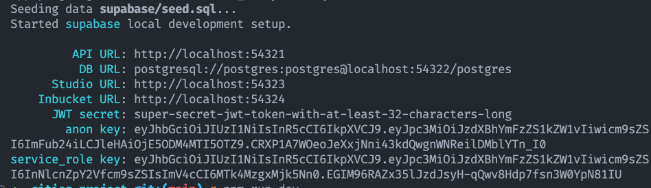
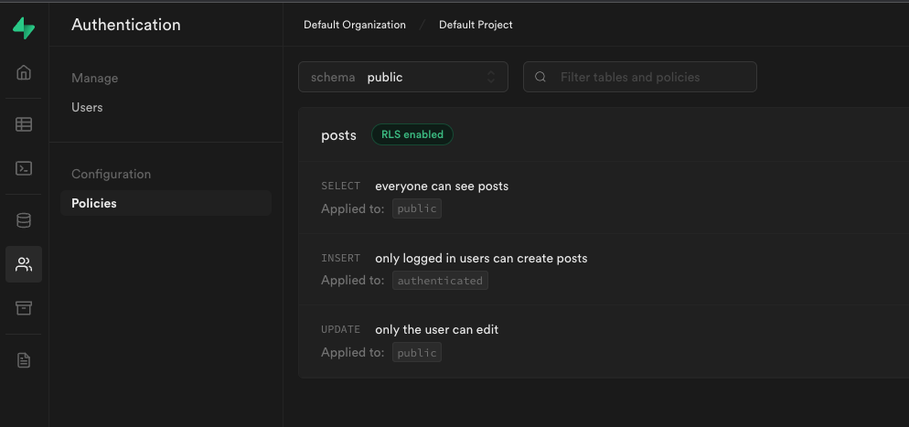
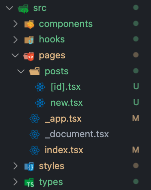

> If you want to jump straight to the source code, here's the link to the [github repository](https://github.com/po8rewq/tuto-blog-nextjs-supabase).

## Introduction

In this tutorial, we will build a simple blogging application using Next.js and Supabase. [Next.js](https://nextjs.org/) is a popular React framework for building server-side rendered and statically generated web applications, while [Supabase](https://supabase.com/) is an open source Firebase alternative that provides a PostgreSQL database and authentication APIs out of the box. By combining these technologies, we can easily create a performant and scalable blogging platform.

Throughout this tutorial, we will cover the following topics:

- Setting up a Next.js project and integrating Supabase for authentication.
- Creating a PostgreSQL database schema for our blog application using Supabase.
- Implementing server-side rendering and client-side routing with Next.js.
- Building a user interface for creating, editing, and deleting blog posts using React components.
- Deploying our application to the cloud using Vercel.

By the end of this tutorial, you will have a fully functional blog application that can be customized and expanded to suit your needs. So let's get started!

## Setup our project

Create a new project with next.js and typescript:

```bash
npx create-next-app@latest --typescript
```

Install supabase and bootstrap:

```bash
npm install supabase --save-dev
npm install @supabase/supabase-js
npm install @supabase/auth-helpers-nextjs @supabase/auth-helpers-react
npm install react-bootstrap bootstrap
```

Now we can initialize supabase:

```bash
npx supabase init
```

Which will create the `supabase` folder with the config, and finally, start all the services:

```bash
npx supabase start
```



Now for the Next.js part, we need to create a `.env.local` file in the project root and add the following environment variables (see the screenshot below for the values):

```text
NEXT_PUBLIC_SUPABASE_URL=<your-supabase-api-url>
NEXT_PUBLIC_SUPABASE_KEY=<your-supabase-api-key>
```

Lets start the dev server:

```bash
npm run dev
```

We are good to go!

<div class="gif">
  <div class="giphy-embed">
    <iframe src="https://giphy.com/embed/ZF3bEnWthZVEYzBeES" width="100%" height="100%" frameBorder="0" ></iframe>
  </div>
  <div class="caption">
    <a href="https://giphy.com/gifs/fallontonight-tonight-show-will-ferrell-whisper-challenge-ZF3bEnWthZVEYzBeES" target="_blank">via GIPHY</a>
  </div>
</div>

## The database

We only need a `posts` table with the following columns:

```sql
create table "public"."posts" (
  "id" uuid not null,
  "title" text not null,
  "body" text not null,
  "created_at" timestamp with time zone default now(),
  "author" uuid not null
);

CREATE UNIQUE INDEX posts_pkey ON public.posts USING btree (id);

alter table "public"."posts" add constraint "posts_pkey" PRIMARY KEY using index "posts_pkey";
alter table "public"."posts" add constraint "posts_author_fkey" FOREIGN KEY (author) REFERENCES auth.users(id) not valid;
alter table "public"."posts" validate constraint "posts_author_fkey";
```

You can either create the table manually, or use the supabase dashboard.

> Quick note on the `author` column: we are using directly the `uuid` from the `auth.users` table.
> Usually as a good practice I would create a `profiles` table with the `id` as the primary key and additionnal infos (like the name, the avatar, etc...).
> But for this tutorial I will keep it simple.

Lets turn on RLS (Row Level Security) for the `posts` table, and authorise everyone to read the table, any logged in user to create posts, and finally only the owner can update:

```sql
alter table "public"."posts" enable row level security;

create policy "everyone can see posts"
on "public"."posts"
as permissive
for select
to public
using (true);

create policy "only logged in users can create posts"
on "public"."posts"
as permissive
for insert
to authenticated
with check (true);

create policy "only the user can edit"
on "public"."posts"
as permissive
for update
to public
using ((auth.uid() = author))
with check ((auth.uid() = author));
```

You can see (and actually create/edit) those policies in the supabase dashboard:



> **Note**: no delete for now - so I've kept it out of the policies - but it would be the same, only owners can delete.

## NextJs setup

Lets get rid of the default page in the `pages` folder and replace the `index.tsx` with the following:

```tsx
import Head from 'next/head';
const Home = () => {
  return (
    <>
      <Head>
        <title>Posts list</title>
        <meta name="description" content="Blog made with NextJs and Supabase" />
        <meta name="viewport" content="width=device-width, initial-scale=1" />
        <link rel="icon" href="/favicon.ico" />
      </Head>
      <main>{/* Our components will go here */}</main>
    </>
  );
};
export default Home;
```

As a reminder, the `pages` folder is a special directory in a Next.js project that contains the pages of your application. When you create a new file in this folder, Next.js automatically generates a route for it based on the file name. For example, the `index.js` in the pages folder, it will be mapped to the root URL of your application.

For our application, we will have the following pages:

- `/`: the home page, which will list all the posts
- `/posts/[id]`: the post detail page
- `/posts/new`: the new post page

In terms of structure, our `src` folder will look like the following:



So to recap, we will have:

- `components`: our React components
- `hooks`: our custom hooks for getting/setting data from supabase
- `pages`: our Next.js pages
- `styles`: for some custom styling
- `types`: for our database types

Everything is now ready, lets jump on the UI!

> Next step: [the UI](/p/create-a-blog-with-supabase-and-nextjs-part-2/)
