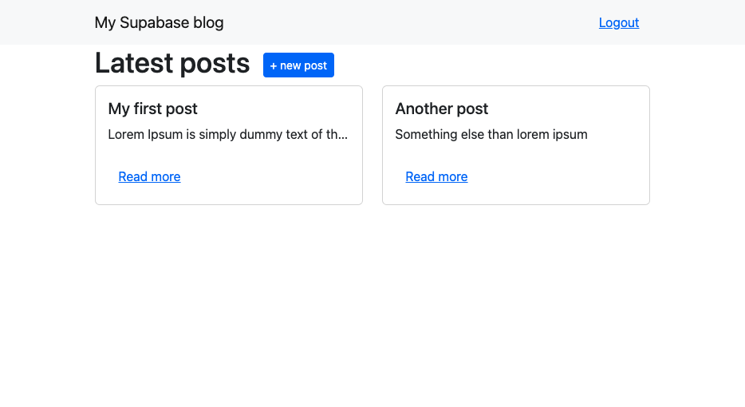
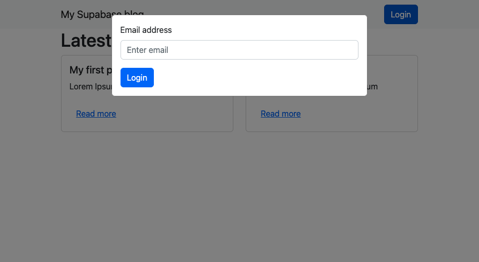
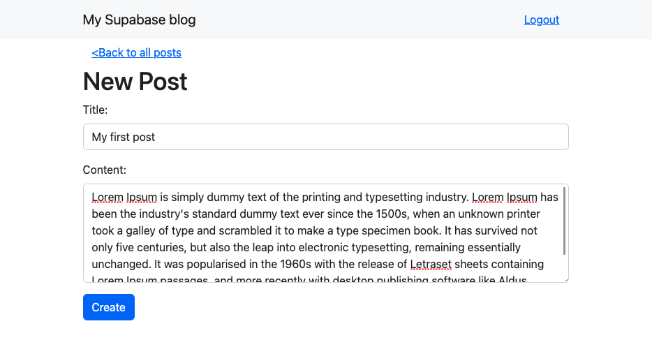
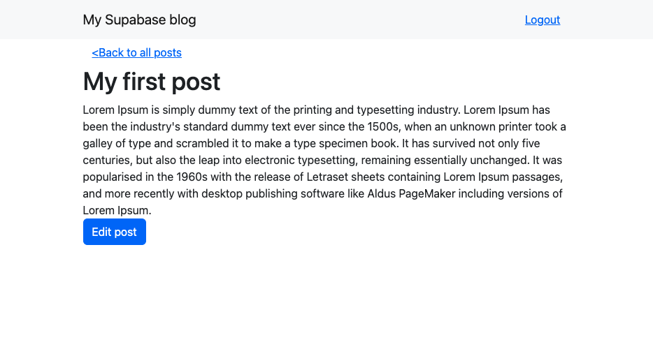

> If you want to jump straight to the source code, here's the link to the [github repository](https://github.com/po8rewq/tuto-blog-nextjs-supabase).

## Preview of the UI

Here's what we are going to build:







## The home page

Based on what we've done in the previous part, we are now going to create a component to display the posts called `PostList`.

```tsx
// --- src/components/PostList.tsx ---
const PostList = () => {
  const [posts, setPosts] = useState<Post[]>([]);
  return (
    <Container>
      <Stack direction="horizontal" gap={3}>
        <h1>Latest posts</h1>
        <Link href={`/posts/new`} legacyBehavior>
          <Button>+ new post</Button>
        </Link>
      </Stack>
      <Row xs={1} md={2}>
        {posts.map((post) => (
          <Col key={post.id}>
            <PostCard post={post} />
          </Col>
        ))}
      </Row>
    </Container>
  );
};
export default PostList;
```

Nothing complicated, we just display the posts in a grid. We also have a button to create a new post.

Because we are using bootstrap, we need to use the `legacyBehavior` prop on the `Link` component to make it work. Now by default `next/link` creates a `a` tag with a `href` attribute. This is not compatible with bootstrap as bootstrap already creates a `a` tag with the `Button` component.

More info in the doc [here](https://nextjs.org/docs/api-reference/next/link#if-the-child-is-a-tag).

> Quick note about the types: we are using the `Post` type from the `types/Post.ts` file which uses the types from the database.
> You can generate them by running: `npm run dev:gen-types`

Now we need a nav bar to display the login button and the title of the blog.

```tsx
// --- src/components/Header.tsx ---
const Header = () => {
  const user = useUser(); // hook from '@supabase/auth-helpers-react';
  const [showModal, setShowModal] = useState(false);
  const handleLogout = () => {
    // logout logic will go here
  };
  return (
    <>
      <SignupModal show={showModal} handleClose={() => setShowModal(false)} />
      <Navbar bg="light">
        <Container>
          <Navbar.Brand href="#home">My Supabase blog</Navbar.Brand>
          <Navbar.Toggle />
          <Navbar.Collapse className="justify-content-end">
            {user ? (
              <Button variant="link" onClick={handleLogout}>
                Logout
              </Button>
            ) : (
              <Button onClick={() => setShowModal(true)}>Login</Button>
            )}
          </Navbar.Collapse>
        </Container>
      </Navbar>
    </>
  );
};
export default Header;
```

Those components will be used in the `index.tsx` file.

```tsx
// --- src/pages/index.tsx ---
const Home = () => {
  return (
    <>
      {/* see previous step */}
      <main>
        <Header />
        <PostList />
      </main>
    </>
  );
};
```

## The login modal 🔒

We are going to use the `Modal` component from [bootstrap](https://react-bootstrap.github.io/components/modal/) to display the login form so we don't need to create a separate page.

```tsx
// --- src/components/SignupModal.tsx ---
const SignupModal = ({ show = false, handleClose }: Props) => {
  const [email, setEmail] = useState('');

  const handleSubmit = async (evt: FormEvent<HTMLFormElement>) => {
    evt.preventDefault();
    // login logic will go here
  };

  return (
    <Modal show={show} onHide={handleClose}>
      <Card body>
        <Form id="login" onSubmit={handleSubmit}>
          <Form.Group className="mb-3" controlId="formLoginEmail">
            <Form.Label>Email address</Form.Label>
            <Form.Control
              type="email"
              value={email}
              onChange={({ target }) => setEmail(target.value)}
            />
          </Form.Group>
          <Button type="submit" disabled={loading}>
            Login
          </Button>
        </Form>
      </Card>
    </Modal>
  );
};

export default SignupModal;
```

## Post creation page

For this new page (`/posts/new`), we are going to keep the logic simple and in the page, the form will be a separated component called `PostEditForm`.

```tsx
// --- src/pages/posts/new.tsx ---
const NewPostPage = () => {
  const handleSubmit = async (title: string, body: string) => {
    // create post logic will go here
  };

  return (
    <>
      <main>
        <Header />
        <Container>
          <Link href="/" legacyBehavior>
            <Button variant="link">{'<'}Back to all posts</Button>
          </Link>
          <h1>New Post</h1>
          <PostEditForm saveForm={handleSubmit} />
        </Container>
      </main>
    </>
  );
};

export default NewPostPage;
```

The `PostEditForm` component is pretty simple, it just displays a form with one input and a submit button.

```tsx
// --- src/components/PostEditForm.tsx ---
const PostEditForm = ({ saveForm, post }: Props) => {
  const [title, setTitle] = useState('');
  const [body, setBody] = useState('');

  // if we are editing a post, we need to set the initial values on mount
  useEffect(() => {
    if (post) {
      setTitle(post.title);
      setBody(post.body);
    }
  }, [post]);

  const handleSubmit = async (e: React.FormEvent<HTMLFormElement>) => {
    e.preventDefault();
    await saveForm(title, body);
  };

  return (
    <Form onSubmit={handleSubmit}>
      <Form.Group className="mb-3">
        <Form.Label>Title:</Form.Label>
        <Form.Control
          value={title}
          onChange={({ target }) => setTitle(target.value)}
        />
      </Form.Group>
      <Form.Group className="mb-3">
        <Form.Label>Content:</Form.Label>
        <Form.Control
          as="textarea"
          rows={3}
          value={body}
          onChange={({ target }) => setBody(target.value)}
        />
      </Form.Group>
      <Button type="submit">Save</Button>
    </Form>
  );
};

export default PostEditForm;
```

## The post page and the edit page 📝

The post page will display the post and a button to edit it. The edit component will be the same as the new post component but with the initial values set.

```tsx
// --- src/pages/posts/[id].tsx ---
const PostPage = ({ post }: Props) => {
  const [isEditing, setIsEditing] = useState(false);

  const handleSubmit = async (title: string, body: string) => {
    // update post logic will go here
  };

  return (
    <main>
      <Header />
      <Container>
        <Link href="/" legacyBehavior>
          <Button variant="link">{'<'}Back to all posts</Button>
        </Link>
        {isEditing ? (
          <PostEditForm post={post} saveForm={handleSubmit} />
        ) : (
          <>
            <h1>{post.title}</h1>
            <div>{post.body}</div>
            {user && user.id === post.author && (
              <Button onClick={() => setIsEditing(true)}>Edit post</Button>
            )}
          </>
        )}
      </Container>
    </main>
  );
};
```

The UI is now done, in the next part we will create the hooks to fetch the data from the database.

> Next step [the hooks](/p/create-a-blog-with-supabase-and-nextjs-part-3/) 🎣
