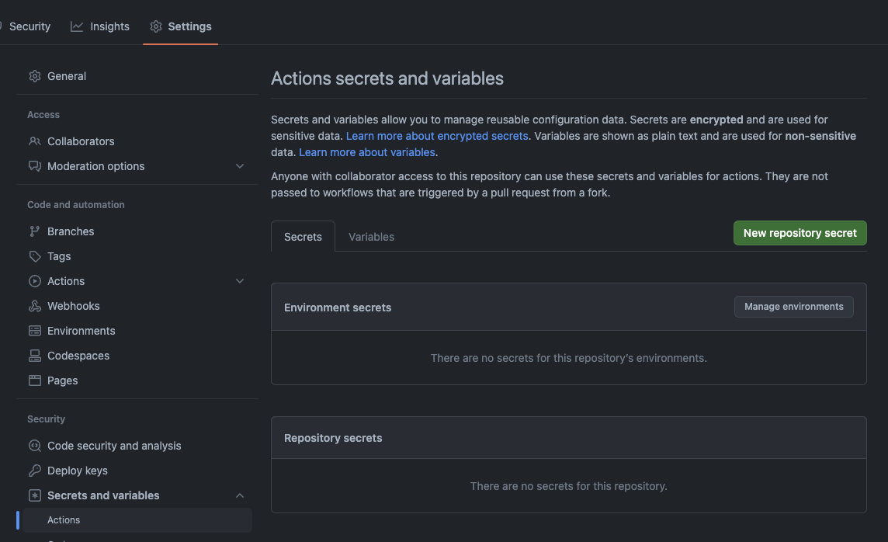
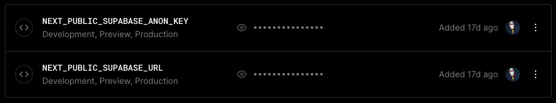

## Create a supabase account

Until now we've been using supabase locally with docker.
Lets create the necessary accounts so we can deploy our blog to the cloud.

Go to [supabase](https://supabase.com/) and create an account, and then a project. We won't go into details about the project creation, you can find more information in the [docs](https://supabase.io/docs).

We have a couple of different ways of doing it, either by using the sql editor and copy pasting the [migration file](https://github.com/po8rewq/tuto-blog-nextjs-supabase/tree/main/supabase/migrations), or by using github actions.

> If you created the database manually from the UI, you can just get the migration by running:
>
> ```bash
> npx supabase db diff -f first-migration
> ```

## Create a Github repository

Create a new repository or fork my [repository](https://github.com/po8rewq/tuto-blog-nextjs-supabase) if you haven't done everything on your side already.

## Github actions

Lets go back to the database. What we want to do is deploy the database to supabase when we push to the main branch. We can do that by using github actions.

```yaml
## .github/workflows/deploy-migrations.yml
name: Deploy Migrations to Supabase

## targets the main branch - when we push to main, the workflow will run
on:
  push:
    branches:
      - main
  workflow_dispatch:

jobs:
  deploy:
    runs-on: ubuntu-latest

    env:
      SUPABASE_ACCESS_TOKEN: ${{ secrets.SUPABASE_ACCESS_TOKEN }}
      SUPABASE_DB_PASSWORD: ${{ secrets.SUPABASE_DB_PASSWORD }}
      SUPABASE_PROJECT_ID: ${{ vars.SUPABASE_PROJECT_ID }}

    steps:
      - uses: actions/checkout@v3

      - uses: supabase/setup-cli@v1
        with:
          version: latest

      - run: |
          supabase link --project-ref $SUPABASE_PROJECT_ID
          supabase db push
```

We need to create a folder called `.github/workflows` and create a file called `deploy-migrations.yml` with the content above.

In github (`Settings` > `Secrets and variables` > `Actions`), we also need to create the following secrets:

- SUPABASE_ACCESS_TOKEN
- SUPABASE_DB_PASSWORD

And the following variable:

- SUPABASE_PROJECT_ID

You can find the values in the supabase dashboard.



## Deploying the blog

First we need to create a [vercel](vercel.com) account and link it to our github account. Once that's done, just create a [new project](https://vercel.com/new).

Once again setup the supabase environment variables in the vercel dashboard. Those values are for Next.js this time.



And that's it, we're done. You can now go to your project and commit/push to the main branch to deploy the database and the blog.
