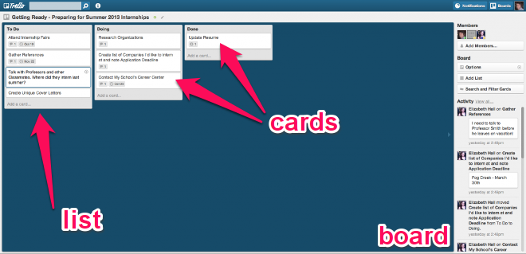
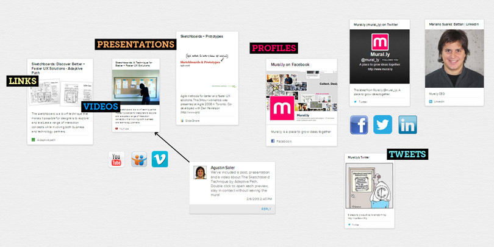

It's been a while since my last post. For my defense, I've started a new job since September, I'm now a project manager on a Digital Cinema project (<a href="http://www.technicolor.com/en/who-we-are/press-news-center/press-releases/technicolor-selected-studiocanal-exclusive-provider-digital-asset-management-services" title="TECHNICOLOR SELECTED BY STUDIOCANAL AS EXCLUSIVE PROVIDER OF DIGITAL ASSET MANAGEMENT SERVICES">see the official press release</a>).

For the first post of the year, I want to give some <strong>feedback</strong> on tools to <strong>increase productivity</strong> on projects.

## Email : the worst thing ever

When you receive at least 100 emails per day... it just becomes really complicated to keep track of everything without missing a conversation or just forget to follow/reply to one.

Sure, <strong>Outlook</strong> (I'm using it at work...) has a task manager, but I don't find it really useful. For example, you can't use it with your team; someone else can create a task for you, but you can't share one you've created... so its use is limited.

It's really easy to lose an email, maybe one you've read on your mobile, and then forgot to answer...

So the question is "<strong>How to keep track of important conversations</strong>" ? My answer is <strong>with Evernote</strong>.

## Evernote : keep track of everything

For those who don't know what <a href="http://evernote.com/evernote/" title="Evernote website">Evernote</a> is:

> Evernote makes it easy to remember things big and small from your everyday life using your computer, phone, tablet and the web.

In my case, I'm using it to <strong>take notes</strong> during meetings and to <strong>save important mails</strong> (questions / remarks from clients). It's easier to search for information through mails when they are well organized and synced between all your devices. You can create <strong>reminders</strong> if you want to be sure not to forget something.

If during a meeting someone draw a diagram, just take a picture and annotate it with <a href="http://evernote.com/skitch/" title="Skitch">Skitch</a>. You can do the same on a web page, by using the <a href="http://evernote.com/webclipper/">web clipper</a> (from your web browser). And of course when you are working on PDF documents, you can also annotate them.

Another useful functionality: you can use Evernote to save <strong>contact cards</strong> (with <a href="http://evernote.com/hello/">Evernote Hello</a>).

But the part I don't like in Evernote is the collaborative part.

For your information, this functionality is part of the <a href="http://evernote.com/premium/">premium package</a>.

If you start using Evernote with shared notes, you will have a lot of conflicts into your notes, and  that's really frustrating. Actually, there is a web-based app which takes care of that: <a href="http://www.liveminutes.com/evernote/">LiveMinutes</a>.

But to share notes, all the members of your team must have a premium account, which is not always the case...

## Trello : collaborate with your team

According to the website

> Trello is the fastest, easiest way to organize anything, from your day-to-day work, to a favorite side project, to your greatest life plans.

To clarify what this tool is, you have <strong>boards</strong> divided into <strong>lists</strong>, divided into <strong>cards</strong>. It's in those cards where you add your tasks, ideas, ...

What a Trello board looks like :

This tool is really useful when used with a team. You can assign people to tasks, add comments on specific cards, add a deadline...

You can use it as a <strong>scrum board</strong> or simply as a personal <strong>todo list</strong>.

Just create cards, drag & drop each one of them into the right list and use <strong>labels</strong> to distinguish cards. <strong>Simple</strong>, <strong>efficient</strong> and <strong>intuitive</strong>.

The best thing is that this tool is <strong>free</strong> and completely free. Of course, give a fee if it helps your journey, but if you can't, you can always use it. There is a premium package, but with gadget options (from my point of view).

## Mural.ly : order your brain

<a href="https://mural.ly/" target="_blank">Mural.ly</a> is an online whiteboard designed to visually organize ideas and collaborate in a playful way.

If you are already using Evernote, just use your notes on murral.ly boards to <strong>organize ideas</strong>, and <strong>brainstorm with your team</strong>.

If you want to add a <strong>link</strong>, just drag and drop it on the wall to display a <strong>capture of the web page</strong>. Create <strong>connections</strong> between ideas, and create layers to demonstrate your ideas (via the presentation mode) to your team and let them participate. Add <strong>stickers</strong> with annotations, <strong>comment</strong> ideas...

Everything is available to help you organize your brain for your projects.
