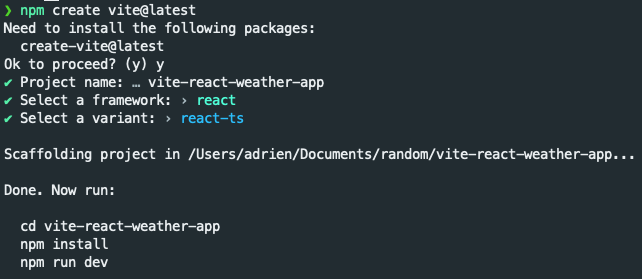
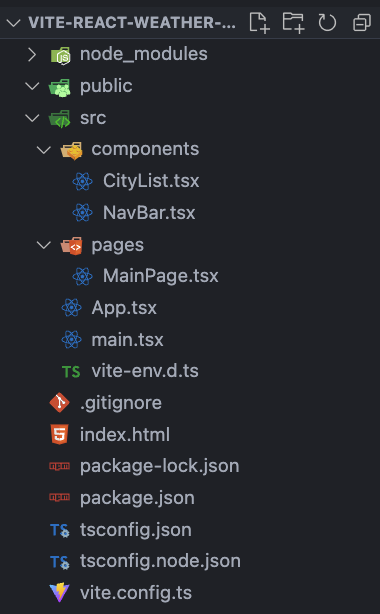
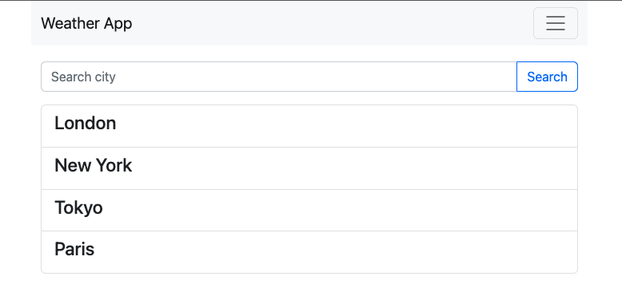

## Setup the project

We are going to use [vite](https://vitejs.dev/), with [react](https://reactjs.org/) and everything will be TypeScript.

The plan for this group of tutorials it to learn how to use vite, quickly build a UI with React and Bootstrap, and then add more features on top of it.

### Vitejs

For this first part, let's start by creating the project:



Most of the boilerplate is unnecessary, so we are going to remove the css files and use [`styled-components`](https://styled-components.com/) instead.

Our folder structure will look like this:



### Additional libraries

Let's install what we need.

```bash
npm run install styled-components --save
npm run install @types/styled-components --save-dev
```

And while we are at it, let's install react-bootstrap:

```bash
npm install react-bootstrap bootstrap --save
npm install react-bootstrap-icons --save
```

Now that we have everything ready, we can start creating the main page, which will contain a search bar and a list of components (cities).
Each city will be clickable.



## Let's build the main page

We only need a search bar, and a list of cities. The `CityList` component will be separate for clarity, and will have a `cities` property containing the results of our search.

For now we will hardcode it to:

```typescript
const cities = [
  { name: 'London', lat: '51.507351', lng: '-0.127758' },
  { name: 'New York', lat: '40.730610', lng: '-73.935242' },
  { name: 'Tokyo', lat: '35.689487', lng: '139.691706' },
  { name: 'Paris', lat: '48.856614', lng: '2.352222' },
];
```

So the main page will look like:

```typescript
// src/pages/MainPage.tsx
const MainPage = () => {
  return (
    <ViewContainer>
      <InputGroup className='mb-3'>
        <Form.Control
          placeholder='Search city'
          aria-label='Search city'
          aria-describedby='city'
        />
        <Button variant='outline-primary' id='city'>
          Search
        </Button>
      </InputGroup>
      <CityList cities={cities} />
    </ViewContainer>
  );
};

export default MainPage;
```

For our `CityList` component, we will only loop over the `cities` property and display the name of each city in a `ListGroup` component.

```typescript
// src/components/CityList.tsx
const CityList = (props: CityListProps) => {
  const onCityClick = (city: City) => {
    console.log(city);
  };

  return (
    <ListGroup>
      {props.cities.map((city) => (
        <ListGroup.Item
          key={city.name}
          action
          onClick={() => onCityClick(city)}
        >
          <h4>{city.name}</h4>
        </ListGroup.Item>
      ))}
    </ListGroup>
  );
};

export default CityList;
```

As we are using typescript, we need to type our variables properly, so here are the types used in this component:

```typescript
type City = { name: string; lat: string; lng: string };
type CityListProps = { cities: Array<City>; };
```

Our first part is now done, we do have a project ready with hardcoded data.

In our second part we will see how to search for cities using MapBox.

> Next step [Part 2](/p/lets-build-a-weather-app-with-vite-and-react-part-2/)
