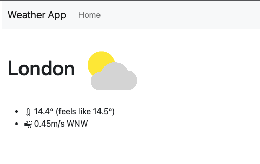

Now that we have our mapbox integration, we want to open a new page when we click on the city.

## Routing

```sh
npm install --save react-router-dom
```

Let's update our main function `App` in order to create a new route and have two pages:

```typescript
function App() {
  return (
    <BrowserRouter>
      <Routes>
        <Route path='/' element={<MainPage />} />
        <Route path='/city' element={<CityPage />} />
      </Routes>
    </BrowserRouter>
  );
}
```

We are now going to slightly change our list in order to open the new page when you click on the link.

In order to do that, we are going to remove the `onClick` we added in [step 1](/p/lets-build-a-weather-app-with-vite-and-react-part-1/#lets-build-the-main-page), and use the `Link` component from `react-router`. 

```typescript
const CityList = (props: CityListProps) => {
  return (
    <ListGroup>
      {props.cities.map((city) => (
        <ListGroup.Item key={city.name} action>
          <Link to={`/city?lat=${city.lat}&lng=${city.lng}`}>{city.name}</Link>
        </ListGroup.Item>
      ))}
    </ListGroup>
  );
};
```

We are going to only use the latitude and longitude in order to identify the cities. So we only need to pass them as url parameters for our new page.

The reason for that is that we are going to use [weatherbit.io](https://weatherbit.io) API and using lat/lng is the recommanded way (and I believe most of the weather API are doing the same).

## Weatherbit API

First thing first, you're going to need to create an account on [weatherbit](https://www.weatherbit.io/account/create) in order to get an API key. It's free, takes 2 minutes and doesn't require a credit card or anything.

Now that it's done, we are going to only use one endpoint: [Current Weather API](https://www.weatherbit.io/api/weather-current).

It's quite straightforward:

```typescript
const url = 'https://api.weatherbit.io/v2.0/current?lat=35.7796&lon=-78.6382&key=API_KEY'
const result = await axios.get(url);
```

Back to our app, we need to get the latitude and longitude from the url, so let's use `react-router`:

```typescript
import { useLocation } from 'react-router-dom';
// [...]

const location = useLocation();
// location.search will be similar to: ?lat=51.507322&lng=-0.127647
const [latqs, lngqs] = location.search.substring(1).split('&');
const lat = latqs.split('=')[1];
const lng = lngqs.split('=')[1];
```

You can move that into a separate method (utils) for clarity (I've called it `getSearchLatLong`).

### Calling the endpoint

We are going to need to call the endpoint once the component is first mounted and save it in the state.
Let's use `useEffect` and `useState` for that:

```typescript
const CityPage = () => {
  const location = useLocation();
  const [weatherData, setWeatherData] = useState<WeatherData>();

  useEffect(() => {
    const getWeather = async () => {
      const {lat, lng} = getSearchLatLong(location.search)

      const url = `https://api.weatherbit.io/v2.0/current?key=${API_KEY}&lat=${lat}&lon=${lng}`;
      const result = await axios.get(url);

      setWeatherData(result.data.data[0]);
    };
    if (!weatherData) getWeather();
  }, []);

  // ...
}
```

The API will return data like:

```json
{
    "data": [
        {
            "wind_cdir": "WSW",
            "rh": 58,
            "pod": "d",
            "lon": -0.1276,
            "pres": 1017.9,
            "timezone": "Europe/London",
            // [...]
        }
    ],
    "count": 1
}
```

We are only going to save the first observation (we should only receive one anyway).

### Displaying the weather

Let's just display the info we received in a simple way:

```typescript
return (
  <Container>
    <NavBar />
    <ViewContainer>
      {weatherData ? (
        <>
          <h1>
            {weatherData.city_name}{' '}
            
          </h1>
          <ul>
            <li>
              <Thermometer /> {weatherData.temp}° (feels like{' '}
              {weatherData.app_temp}°)
            </li>
            <li>
              <Wind /> {weatherData.wind_spd}m/s {weatherData.wind_cdir}
            </li>
          </ul>
        </>
      ) : (<div>Loading...</div>)}
    </ViewContainer>
  </Container>
)
```

A couple of things to note:

The `Thermometer` and `Wind` components are both images from [`react-bootstrap-icons`](https://icons.getbootstrap.com/), so if you want to use it, just install the lib and import the component you want.

Weatherbit does return an icon for the current weather, so we simply are going to use their image. More info can be found [here](https://www.weatherbit.io/api/codes).



In the next tutorial, we will save the cities in the local storage in order to quickly access the ones we've looked at already.
