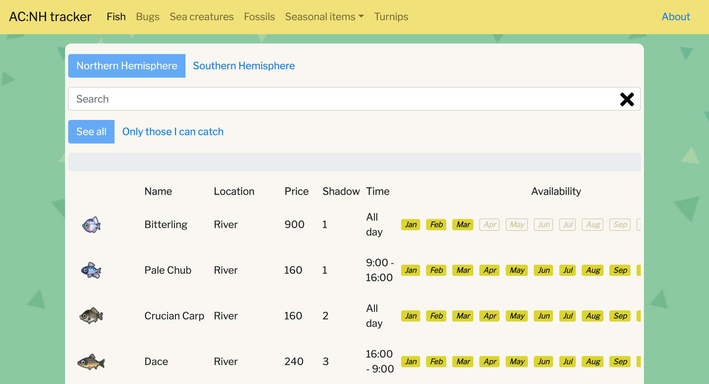
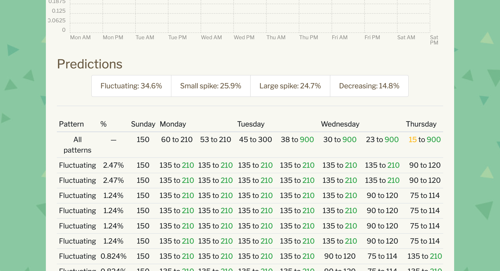

Tracker for Animal Crossing: New Horizons.

## Features

* View/track bugs by hemisphere and when/where you can catch them
* View/track fish by hemisphere and when/where you can catch them
* View/track fossils
* View/track events recipe list (Bunny Day - Cherry-blossom)
* Follow your town's turnip price market (based on [mikebryant/ac-nh-turnip-prices](https://github.com/mikebryant/ac-nh-turnip-prices) project)

## Tech

* React
* Bootstrap

## The project

* [Github repo](https://github.com/po8rewq/acnh-tracker)
* [Access the app](https://po8rewq.github.io/acnh-tracker)

  
  

