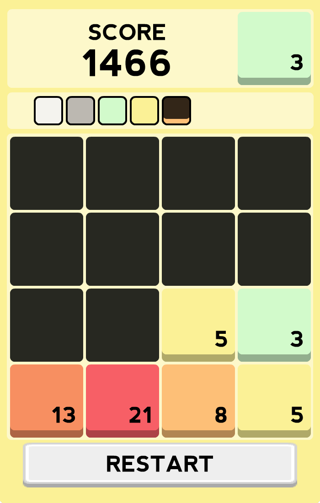
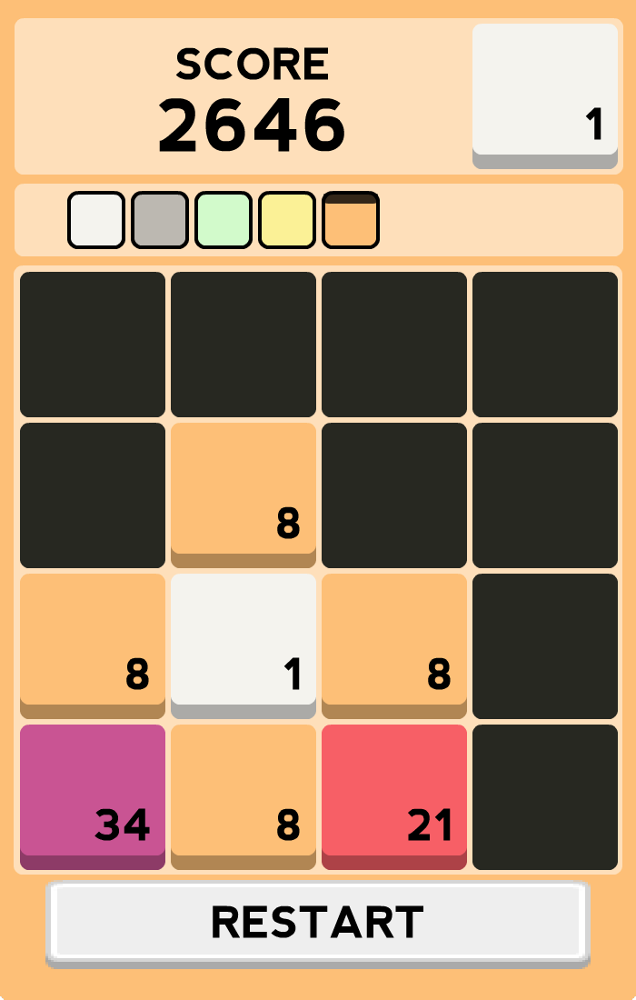
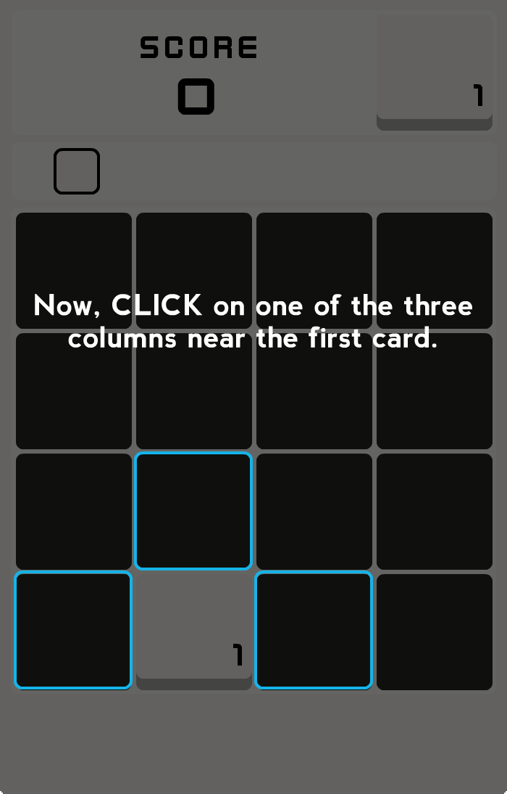
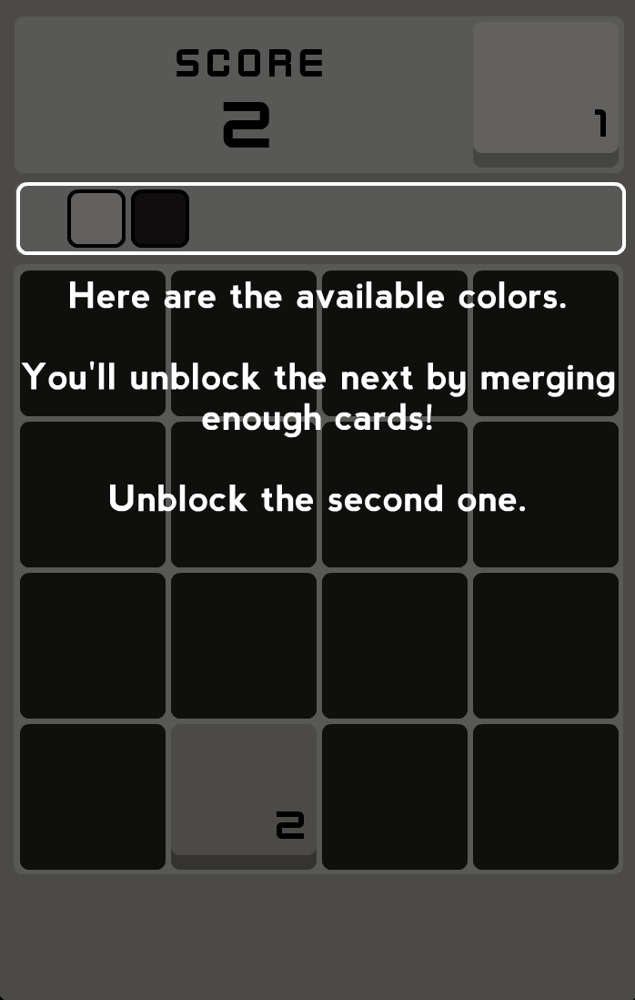

Inspired by tetris and [threes](http://asherv.com/threes/), Coloring is a game in which you have to merge and transform colors.

Align at least **two** colors to merge them and create the next color.

You start a game with only one color. You then have two goals :

* merge the squares of the same colors to create a new one
* in doing so, you fill a square of each color to make the next one available to play.

	
	

The game includes a tutorial which will help you understand how to play and to make great combos to reach the first place of the leaderboard!

	
	

What are you waiting for? The game is free!

  <iframe src="//itch.io/embed/21147" width="552" height="167" frameborder="0"></iframe>

  

