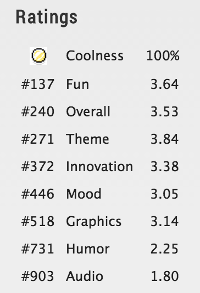

> <a href="/coloring.html">Check out the new mobile version</a>

    The theme was <strong>Entire Game on One Screen</strong>. You can find the source code <a href="https://github.com/po8rewq/LD31">here</a> and vote <a href="http://ludumdare.com/compo/ludum-dare-31/?action=preview&uid=4401">here</a>.

    

        

    

    

        <h3>How to play ?</h3>
        

          Select a column to drop the card in it.
            Two cards of the same color will merge into the next color (see the list below).
            Two red cards will disappear.
        

         
        

            
A card can remove cards only if they collide directly and are of the same color :

            

        

         
        
Colors will appear in this order: 

         
        

            
            
            
            
            
            
            
            
        

         
        

            You can't remove the black  ones, but they have a limited time on the board.
        

    

 

    

        

            Got ranked <strong>240</strong> out of <strong>1365</strong>. Check out the results:
        

    

    

        
    

