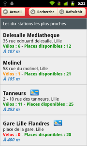
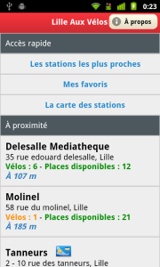
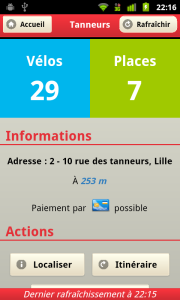
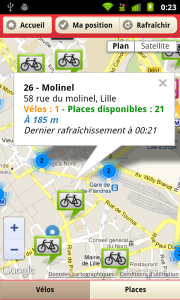

3 heures du matin, fin de soirée, il faut se résoudre à partir...

> On rentre en <strong>Vlille</strong> ?

Retrouvez à chaque instant sur votre téléphone toutes les informations concernant le réseau <strong>Vlille</strong> de <strong>Lille</strong> et sa <strong>métropole</strong> !

Quelle est la station la plus proche de ma position actuelle ? Des vélos y sont-ils encore disponibles ? Quel itinéraire emprunter ? Vérifiez toutes ces données en un clin d'oeil, et placez vos stations préférées en favoris.

## Fonctionnalités

* Affichage des trois <strong>stations les plus proches</strong> directement sur la page d'accueil
* Sauvegarde des <strong>favoris</strong>
* <strong>Recherche</strong> par nom de station, adresse et ville
* Affichage des stations sur la <strong>carte</strong> ; les marqueurs des stations sont regroupés s'ils sont trop proches (pour aider la lisibilité, un simple clic permet de zoomer et d'afficher les marqueurs situés à cet endroit)
* Choix du mode d'affichage : vélos disponibles ou emplacements libres

	
  
  
  
  

>	<strong>Lille Aux Vélos</strong> est une application non-officielle.
>	<a href="http://vlille.fr">Vlille</a> est un service proposé par <a href="http://transpole.fr">Transpole</a> ; pour plus d'informations concernant le réseau, rendez-vous sur le site <a href="http://vlille.fr">Vlille.fr</a>.

## Technologies utilisées

<a href="http://jquerymobile.com">JQueryMobile</a>, <a href="http://cordova.apache.org">Cordova</a>, <a href="https://developers.google.com/maps">Google Maps</a>, <a href="http://haxe.org">Haxe</a>

